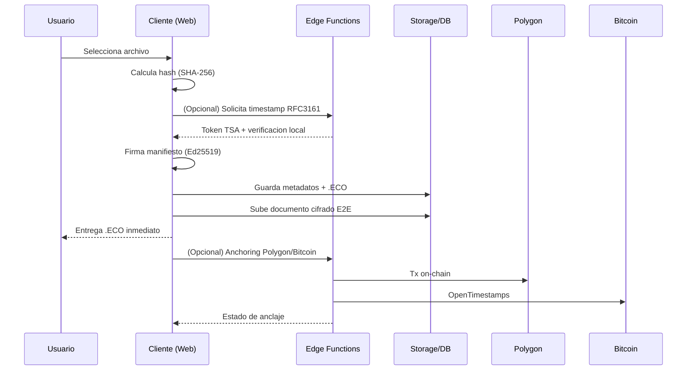

# COMO LO HACEMOS (version tecnica para desarrolladores)

Este documento describe el flujo tecnico y las interfaces publicas del sistema.
En algunos puntos se omiten detalles internos por razones de proteccion
estrategica. Donde corresponde, se usan seudocodigos y contratos de datos
estables.

Referencias:
- `NOTICE.md`
- `docs/OPEN_SOURCE_STRATEGY.md`
- `docs/verification-cli.md`
- `docs/examples/sample.eco.json`

## Principios clave (mapeo a codigo)

- Zero-knowledge aplicado a evidencia: la huella (SHA-256) se calcula en el
  navegador y la evidencia se construye sin exponer el contenido. Ver
  `client/src/lib/basicCertificationWeb.ts`.
- E2E siempre activo para almacenamiento: los documentos se suben cifrados
  lado cliente; la plataforma no accede al contenido en claro. Ver
  `client/src/lib/storage/encryptedDocumentStorage.ts`.
- Certificado verificable sin la plataforma: la verificacion es determinista y
  se basa en el manifiesto, firma y hash. Ver `supabase/functions/verify-ecox/index.ts`.
- Timestamp legal opcional (RFC 3161) con validacion local del token.
  Ver `client/src/lib/tsaService.ts` y `client/src/lib/tsrVerifier.ts`.
- Anclaje opcional en blockchain (Polygon y Bitcoin) sin bloquear la entrega del
  certificado. Ver `client/src/lib/polygonAnchor.ts`, `supabase/functions/anchor-polygon/index.ts`,
  `supabase/functions/anchor-bitcoin/index.ts` y comentarios en
  `client/src/lib/basicCertificationWeb.ts`.
- Auditabilidad completa con trazas de eventos. Ver `client/src/utils/eventLogger.ts` y
  `supabase/functions/log-ecox-event/index.ts`.
- Certificado .ECO que contiene prueba y cronologia, no el documento original.
  Ver `client/src/lib/basicCertificationWeb.ts` y `supabase/functions/verify-ecox/index.ts`.
- Almacenamiento E2E siempre activo cuando se sube el documento.
  Ver `client/src/lib/storage/encryptedDocumentStorage.ts`.
- Firma certificada con proveedor externo (p. ej. SignNow) en flujo separado.
  Ver `supabase/functions/signnow/index.ts` y `supabase/functions/signnow-webhook/index.ts`.

## Flujo principal: certificacion local

Seudocodigo (sin detalles propietarios):

```
function certify(file, options):
  bytes = readLocal(file)
  hash = sha256(bytes)
  keys = getOrCreateEd25519Keypair()

  if options.useLegalTimestamp:
    tsa = requestRFC3161(hash)         // Edge Function + validacion local del token
    timestamp = tsa.timestamp
  else:
    timestamp = localClock()

  manifest = buildManifest(fileMeta, hash, timestamp)
  signature = sign(manifest, keys.privateKey)

  eco = buildEcoJSON(
    manifest,
    signature,
    timestamp,
    metadata = { clientInfo, intent, policySnapshot, ... }
  )

  persistEcoMetadata(eco)              // DB + storage
  return { eco, hash, timestamp }
```

Codigo relacionado: `client/src/lib/basicCertificationWeb.ts`,
`client/src/utils/documentStorage.ts`.

## Flujo de verificacion (.ECO)

Seudocodigo (Edge Function):

```
function verify(ecoFile, originalFile?):
  if isJSON(ecoFile):
    manifest, signatures, metadata = parseUnifiedEco(ecoFile)
  else:
    manifest, signatures, metadata = parseLegacyZip(ecoFile)

  signatureValid = verifyEd25519(manifest, signatures[0])
  hashMatches = true

  if originalFile provided:
    hashMatches = sha256(originalFile) == manifest.asset.hash

  return result(valid = signatureValid && hashMatches, warnings, errors)
```

Codigo relacionado: `supabase/functions/verify-ecox/index.ts`,
`client/src/lib/verificationService.ts`.

## Timestamp legal (RFC 3161)

Seudocodigo:

```
function requestRFC3161(hash):
  token = edgeFunction('legal-timestamp', { hash })
  verified = verifyTsrTokenLocally(token, hash)
  return { token, verified, timestamp, tsaInfo }
```

Codigo relacionado: `client/src/lib/tsaService.ts`,
`client/src/lib/tsrVerifier.ts`.

## Anclaje en blockchain (opcional)

Polygon (tx on-chain) y Bitcoin (OpenTimestamps) se solicitan de forma
asincrotonica para no bloquear la entrega del .ECO.

Seudocodigo:

```
function anchorHash(hash):
  if options.polygon:
    queuePolygonAnchor(hash)  // Edge Function -> contrato en Polygon
  if options.bitcoin:
    queueBitcoinAnchor(hash)  // Edge Function -> OpenTimestamps
```

Codigo relacionado: `client/src/lib/polygonAnchor.ts`,
`supabase/functions/anchor-polygon/index.ts`,
`supabase/functions/anchor-bitcoin/index.ts`.

## Audit trail y eventos

Cada paso relevante puede generar eventos de auditoria (creacion, firma,
descarga, verificacion). Esto permite reconstruir la cronologia sin exponer el
contenido del documento.

Codigo relacionado: `client/src/utils/eventLogger.ts`,
`supabase/functions/log-ecox-event/index.ts`,
`supabase/functions/process-signature/index.ts`.

## Que guardamos y que no guardamos

Guardamos (segun flujo):
- Hash del documento y metadatos de certificado (JSONB).
- .ECO en storage si el usuario habilita descarga diferida.
- Eventos de auditoria y anclajes.
- Documento cifrado E2E cuando se sube el archivo.

No guardamos:
- El contenido del documento para generar evidencia.
- El contenido del documento en claro.

Ver `client/src/lib/storage/encryptedDocumentStorage.ts`.

## eco-packer (boundary de propiedad intelectual)

eco-packer es una libreria interna para empaquetado y validacion avanzada de
.ECO/.ECOX. En este repo se publica solo su interfaz y uso externo. La
implementacion interna y optimizaciones criptograficas permanecen reservadas
por razones estrategicas.

Seudocodigo de interfaz (sin detalles):

```
eco = EcoPacker.pack(manifest, signatures, metadata)
EcoPacker.verify(eco)
```

Si necesitas integrar eco-packer en otro proyecto, consulta el equipo para
licenciamiento y acceso a la version completa.

## Diagrama de flujo (alto nivel)



## Contrato de datos (.ECO unificado)

Ejemplo JSON de alto nivel (campos esenciales):

```json
{
  "version": "1.1.0",
  "certificate_schema_version": "1.0",
  "manifest": {
    "projectId": "doc-1700000000000",
    "metadata": {
      "title": "contrato.pdf",
      "createdAt": "2025-01-01T12:00:00Z",
      "author": "user@email.com"
    },
    "assets": [
      {
        "assetId": "asset-1700000000000",
        "name": "contrato.pdf",
        "size": 123456,
        "hash": "sha256_hex"
      }
    ]
  },
  "signatures": [
    {
      "algorithm": "Ed25519",
      "publicKey": "hex",
      "signature": "hex",
      "timestamp": "2025-01-01T12:00:00Z",
      "legalTimestamp": {
        "standard": "RFC 3161",
        "tsa": "https://freetsa.org/tsr",
        "tokenSize": 4200,
        "verified": true
      }
    }
  ],
  "metadata": {
    "certifiedAt": "2025-01-01T12:00:00Z",
    "forensicEnabled": true,
    "anchoring": { "polygon": true, "bitcoin": false }
  },
  "intent": { "intent_confirmed": true, "intent_method": "explicit_acceptance" },
  "time_assurance": { "source": "RFC3161", "confidence": "high" },
  "policy_snapshot_id": "policy_2025_11",
  "event_lineage": { "event_id": "uuid", "previous_event_id": null }
}
```

## Estrategia de apertura de codigo (eco-packer)

Objetivo: abrir el repo sin exponer la implementacion sensible.

Plan sugerido:
1) Extraer `eco-packer/` a un repo privado y publicar solo una API surface
   minima (stubs o interfaces) en este repo.
2) Reemplazar imports por un wrapper publico que defina tipos y contratos,
   y deje la implementacion privada via build step o paquete privado.
3) Publicar un SDK reducido con funciones seguras: `pack()`, `verify()`,
   `unpack()` sin detalles internos.
4) En este repo, documentar solo el contrato JSON y ejemplos, no algoritmos.
5) Agregar un `NOTICE.md` indicando que hay componentes con implementacion
   reservada por razones estrategicas.
