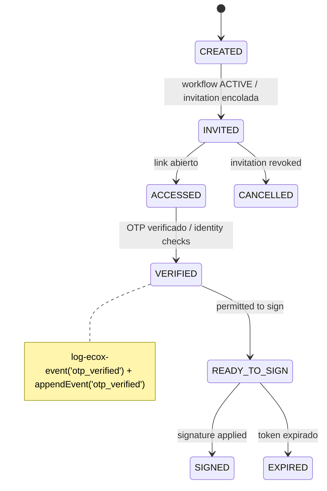

# Signer States — EcoSign
Fecha: 2026-01-12T17:33:37.144Z

Descripción
-----------
Estados por firmante. Uso en UI y backend para validar operaciones permitidas.

Mermaid (state diagram)
-----------------------

Notas rápidas
-------------
- Reemplazo: un signer puede reemplazarse si su estado es anterior a SIGNED.
- Eventos clave: signer_invited, access_link_opened, otp_sent, otp_verified, signature_completed.

Nota adicional
---------------
- EXPIRED is a transient state; the signer may return to INVITED upon token reissue.
