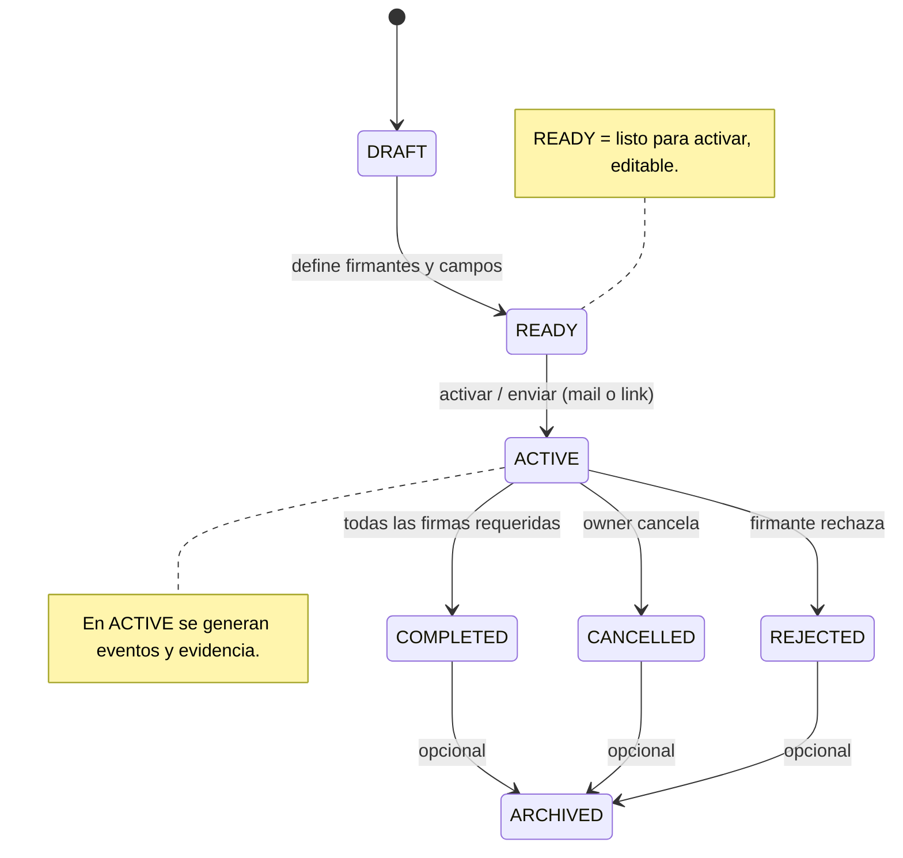

# Workflow States — EcoSign
Fecha: 2026-01-12T17:33:37.144Z

Descripción
-----------
Diagrama de estados canónico para un signature workflow. Uso: product/dev/QA para entender transiciones permitidas.

Mermaid (state diagram)
-----------------------

Notas rápidas
-------------
- DRAFT: editable completamente.
- READY: definición final pero aún sin evidencia ni notificaciones.
- ACTIVE: flujos en curso; algunas modificaciones permitidas (firmantes no firmados), documento inmutable.
- COMPLETED/CANCELLED/REJECTED: sólo lectura y exportables.

Nota adicional
---------------
- Un workflow en CANCELLED o REJECTED no puede reactivarse. Para continuar, crear un nuevo workflow para el mismo document_entity.
