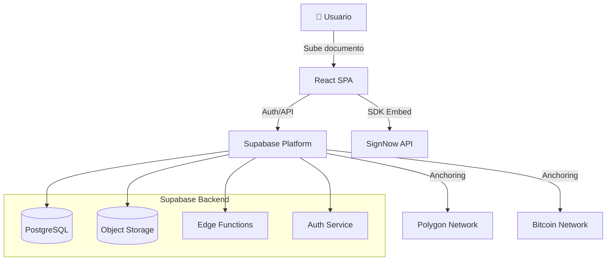

# Anexo Completo - Documentación Técnica y Operativa de Ecosign

**Versión:** v1.0  
**Fecha:** 2026-01-21  
**Estado:** CANÓNICO

---

## Tabla de Contenidos

1. [Arquitectura del Sistema](#arquitectura-del-sistema)
2. [Contratos Canónicos Importantes](#contratos-cánicos-importantes)
3. [Decisiones Arquitectónicas Clave](#decisiones-arquitectónicas-clave)
4. [Sistema de Autoridad y Orquestación](#sistema-de-autoridad-y-orquestación)
5. [Flujo de Anclaje](#flujo-de-anclaje)
6. [Seguridad y Buenas Prácticas](#seguridad-y-buenas-prácticas)
7. [Auditorías y Validaciones](#auditorías-y-validaciones)
8. [Sistema de Logs y Observabilidad](#sistema-de-logs-y-observabilidad)

---

## Arquitectura del Sistema

### Visión General

EcoSign es una aplicación JAMStack para la protección y evidencia técnica de documentos digitales con capacidades de registro en blockchain (Polygon y Bitcoin).

### Componentes Principales

1. **Cliente (`/client`)**: SPA React/Vite con interfaz de usuario
2. **Backend (`/supabase`)**: BaaS con auth, DB, storage, functions
3. **Librería compartida (`/eco-packer`)**: Lógica de negocio y formato .ECO/.ECOX
4. **Contratos inteligentes (`/contracts`)**: Anclaje en Polygon
5. **Documentación (`/docs`)**: Documentación técnica y decisiones de arquitectura

### Arquitectura de Datos



### Componentes Canónicos

#### Entidad de Documento (`document_entities`)

Representa una unidad lógica de verdad documental:

```ts
DocumentEntity {
  id: UUID
  owner_id: UUID
  source_name: string
  source_mime: string
  source_size: number
  source_hash: SHA256
  source_captured_at: Timestamp
  source_storage_path?: string
  custody_mode: 'hash_only' | 'encrypted_custody'
  lifecycle_status: 'protected' | 'needs_witness' | 'witness_ready' | 'in_signature_flow' | 'signed' | 'anchored' | 'revoked' | 'archived'
  witness_current_hash?: SHA256
  witness_current_mime?: string
  witness_current_status?: 'generated' | 'signed'
  witness_current_storage_path?: string
  witness_current_generated_at?: Timestamp
  witness_history: Witness[]
  witness_hash?: SHA256
  signed_hash?: SHA256
  composite_hash?: SHA256
  hash_chain: HashChain
  transform_log: TransformLog[]
  events: Event[]
  created_at: Timestamp
  updated_at: Timestamp
}
```

#### Eventos Canónicos (`document_entities.events[]`)

Array append-only que contiene el ledger probatorio:

```ts
Event {
  kind: string
  at: Timestamp
  [payload]: any // Datos específicos por tipo de evento
}
```

### Flujo de Datos Canónico

1. **Documento subido** → `document_entities` creado
2. **Protección solicitada** → `document.protected.requested` emitido
3. **TSA ejecutado** → `tsa.confirmed` emitido
4. **Anclaje solicitado** → `anchor.submitted` emitido
5. **Anclaje confirmado** → `anchor` emitido
6. **Artefacto generado** → `artifact.finalized` emitido

---

## Contratos Canónicos Importantes

### Verdad Canónica

**Principio Fundamental:** La verdad de un documento es su contenido original en un instante exacto del tiempo. Todo lo demás (PDF, firmas, flujos, blockchain) son derivados o testigos de esa verdad.

### Niveles de Identidad

| Nivel | Método | Costo | Fricción | Uso típico |
|-------|--------|-------|----------|------------|
| **L0** | Acknowledgement explícito | $0 | Ninguna | Acuerdos simples |
| **L1** | Magic Link (Email) | $0 | Baja | NDAs, aprobaciones |
| **L2** | OTP SMS / Voice | Bajo | Media | Flujos comerciales |
| **L3** | Passkey (WebAuthn) | $0 | Muy baja | Usuarios frecuentes |
| **L4** | Biométrico + ID | Alto | Alta | Inmobiliario, crédito |
| **L5** | Certificado (QES / e.firma) | Alto | Alta | Escrituras, fiscal |

### Niveles de Protección

- **PROTECTED**: `tsa.confirmed` presente
- **REINFORCED**: `tsa.confirmed` + al menos 1 `anchor` confirmado
- **MAXIMUM**: `tsa.confirmed` + `anchor` para Polygon + `anchor` para Bitcoin

### Eventos Canónicos

#### Eventos de Evidencia Fuerte
- `document.signed` - Intención de firma
- `tsa.confirmed` - Protección temporal verificable
- `anchor` - Confirmación de anclaje en blockchain
- `artifact.finalized` - Artefacto probatorio generado

#### Eventos de Seguimiento
- `anchor.submitted` - Solicitud de anclaje
- `tsa.failed` - Fallo de TSA
- `anchor.failed` - Fallo de anclaje
- `artifact.failed` - Fallo de generación de artefacto

---

## Decisiones Arquitectónicas Clave

### Sistema de Autoridad

**Principio:** El executor es el único juez de causalidad. Todos los eventos pasan por validación de autoridad.

**Reglas:**
- El executor decide qué jobs se encolan basado en eventos canónicos
- Los workers solo ejecutan tareas técnicas
- Todos los eventos deben pasar por validación de autoridad
- La verdad canónica vive en `document_entities.events[]`

### Eventos Append-Only

**Principio:** Los eventos son inmutables y solo se agregan. El estado se deriva de eventos, no se almacena.

**Implementación:**
- Trigger de base de datos que impide modificaciones a `events[]`
- Validación de estructura de eventos en `appendEvent()`
- Validación de autoridad de emisor en `appendEvent()`

### Validación de Autoridad

**Principio:** Solo funciones autorizadas pueden emitir eventos de evidencia fuerte.

**Implementación:**
- Allowlist de fuentes autorizadas por tipo de evento
- Validación de `_source` para eventos de evidencia fuerte
- Validación de causalidad temporal para eventos de confirmación

---

## Sistema de Autoridad y Orquestación

### Executor (Juez de Causalidad)

**Responsabilidad:** Decidir qué jobs se deben encolar basado en eventos canónicos.

**Flujo:**
1. Lee `document_entities.events[]`
2. Aplica reglas puras de decisión
3. Encola jobs en `executor_jobs` con dedupe
4. Registra "reason" para auditabilidad

**Tipos de Jobs:**
- `protect_document_v2` - Protección de documento
- `build_artifact` - Generación de artefacto
- `submit_anchor_polygon` - Solicitud de anclaje Polygon
- `submit_anchor_bitcoin` - Solicitud de anclaje Bitcoin

### Workers (Ejecutores Técnicos)

**Responsabilidad:** Ejecutar tareas técnicas sin tomar decisiones de negocio.

**Ejemplos:**
- `legal-timestamp` - Obtención de sello de tiempo
- `anchor-polygon` - Solicitud de anclaje en Polygon
- `anchor-bitcoin` - Solicitud de anclaje en Bitcoin
- `build-artifact` - Generación de artefacto final

### Validación de Eventos

**Principio:** Todos los eventos pasan por validación antes de ser agregados.

**Validación:**
- Estructura válida (kind, at presentes)
- Autoridad de emisor (source autorizado para tipo de evento)
- Causalidad temporal (confirmed_at ≥ at para eventos de confirmación)

---

## Flujo de Anclaje

### Anclaje en Polygon

**Flujo:**
1. `submit-anchor-polygon` recibe solicitud
2. Emite `anchor.submitted` con `payload.network = 'polygon'`
3. `process-polygon-anchors` confirma transacción en blockchain
4. Emite `anchor` con `payload.network = 'polygon'` y `payload.confirmed_at`

### Anclaje en Bitcoin

**Flujo:**
1. `submit-anchor-bitcoin` recibe solicitud
2. Emite `anchor.submitted` con `payload.network = 'bitcoin'`
3. `process-bitcoin-anchors` confirma OpenTimestamps
4. Emite `anchor` con `payload.network = 'bitcoin'` y `payload.confirmed_at`

### Validación de Confirmación

**Regla:** Un anclaje está confirmado si y solo si:
- Tiene `kind = 'anchor'` (o `anchor.confirmed`)
- Tiene `payload.network` (polygon o bitcoin)
- Tiene `payload.confirmed_at`
- `payload.confirmed_at ≥ event.at` (causalidad temporal)

---

## Seguridad y Buenas Prácticas

### Gestión de Secretos

**Principio:** Los secretos se gestionan de forma segura usando Supabase Secrets Management.

**Secretos Configurados:**
- `POLYGON_PRIVATE_KEY` - Clave privada para transacciones en Polygon
- `POLYGON_RPC_URL` - Endpoint RPC de Polygon
- `RESEND_API_KEY` - API key para envío de emails
- `BICONOMY_*` - Claves para account abstraction

### Validación de Autoridad

**Principio:** Solo funciones autorizadas pueden emitir eventos de evidencia fuerte.

**Implementación:**
- Allowlist de fuentes por tipo de evento
- Validación de `_source` en `appendEvent()`
- Clasificación formal de eventos como `'evidence'` o `'tracking'`

### Seguridad de Datos

**Principio:** El sistema no almacena contenido de documentos sin encriptación.

**Implementación:**
- Opción `hash_only` para no almacenar documentos
- Opción `encrypted_custody` para almacenamiento encriptado
- Client-side hashing antes de upload

---

## Auditorías y Validaciones

### Estado del Sistema (Auditoría 2026-01-16)

**Ejecutivo:**
- El sistema es arquitectónicamente sólido pero tiene gaps de ejecución
- El executor está implementado pero no activo
- El flujo de anclaje funciona pero el trigger está roto
- Los eventos canónicos están correctamente implementados

**Áreas Críticas:**
- **Executor:** Infraestructura existe pero no está activa
- **Anchoring:** Dual-write working, trigger broken
- **Notifications:** Algunas duplicidades, manejables

### Validación de Causalidad Temporal

**Principio:** Los eventos de confirmación no pueden tener fechas anteriores a su solicitud.

**Validación:**
- `anchor.confirmed` debe tener `confirmed_at ≥ at`
- `tsa.confirmed` debe tener `confirmed_at ≥ at`
- Rechazo de eventos con causalidad temporal inválida

---

## Sistema de Logs y Observabilidad

### Logs de Decisiones del Executor

**Propósito:** Registrar todas las decisiones del executor para auditabilidad y debugging.

**Estructura:**
```ts
ExecutorDecisionLog {
  id: UUID
  document_entity_id: UUID
  policy_version: string
  events_hash: string
  decision: string[] // Array de jobs decididos
  reason: string
  metadata: JSON
  created_at: Timestamp
}
```

**Beneficios:**
- Trazabilidad completa de decisiones
- Identificación de responsables
- Verificación de consistencia
- Diagnóstico de problemas

### Clasificación de Eventos

**Principio:** Distinguir entre eventos de evidencia fuerte y eventos de seguimiento.

**Clasificación:**
- **Evidencia (`evidence`)**: `tsa.confirmed`, `anchor`, `artifact.finalized`
- **Seguimiento (`tracking`)**: `anchor.submitted`, `tsa.failed`, `anchor.failed`

**Validación:**
- Eventos de evidencia requieren `_source` verificable
- Eventos de seguimiento también requieren `_source` verificable
- Validación estricta de autoridad de emisor

---

## Conclusión

Este anexo proporciona una visión completa de la arquitectura, contratos, decisiones y sistemas de Ecosign. Combina la información dispersa en múltiples archivos en una única fuente de verdad para comprensión y referencia rápida.

**Importante:** Este documento complementa, no reemplaza, los contratos canónicos individuales. Para cambios oficiales, deben modificarse los archivos originales en `/docs/contratos/`.
