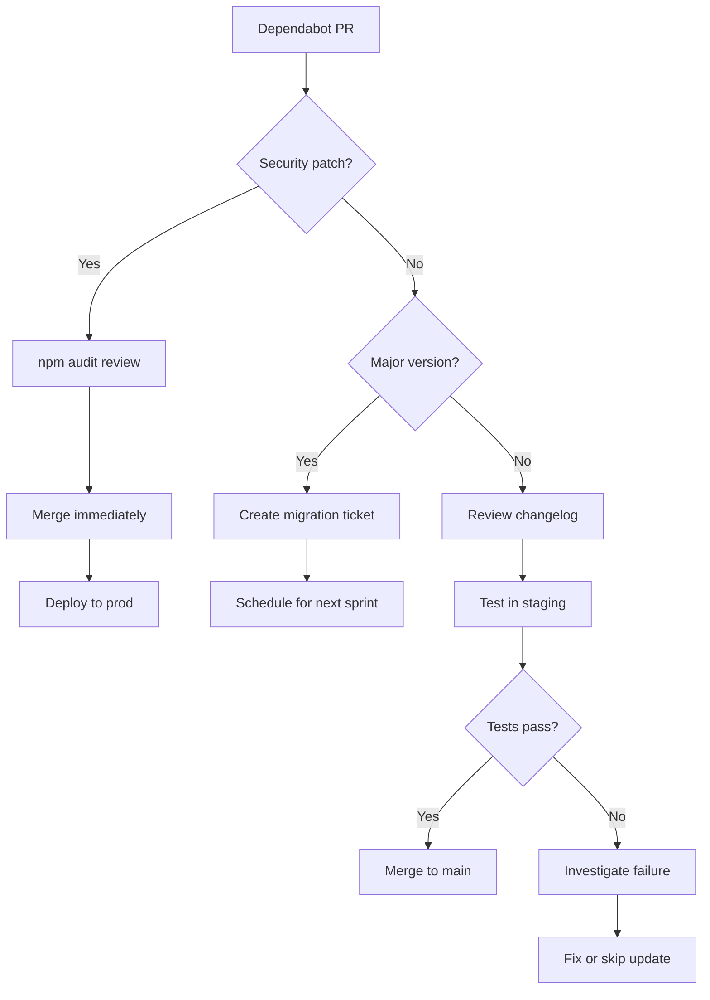
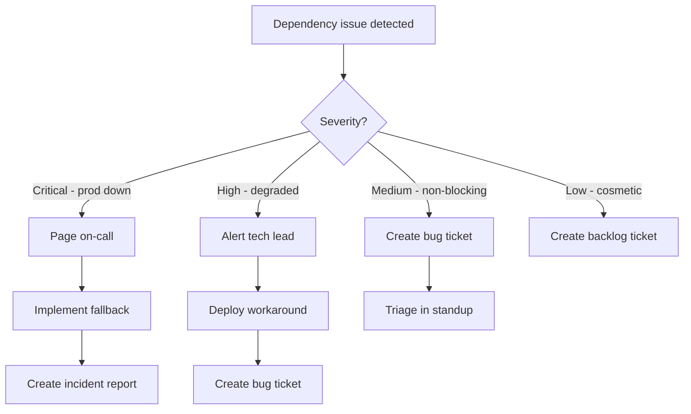

# Dependency Management Guide

## Table of Contents
- [Overview](#overview)
- [Dependency Matrix](#dependency-matrix)
- [Critical Dependencies](#critical-dependencies)
- [Security & Audit Strategy](#security--audit-strategy)
- [Update Policy](#update-policy)
- [Supply Chain Security](#supply-chain-security)
- [Fallback Strategies](#fallback-strategies)
- [SLA & Support](#sla--support)
- [License Compliance](#license-compliance)
- [Deprecation & Migration](#deprecation--migration)
- [Monitoring](#monitoring)

---

## Overview

### Dependency Philosophy

EcoSign's dependency strategy balances three priorities:

1. **Security First** - Never compromise on cryptographic library integrity
2. **Minimal Surface Area** - Fewer dependencies = less attack surface
3. **Long-term Maintainability** - Prefer libraries with strong community backing

**Golden Rule:** Every dependency is a potential vulnerability. Justify every addition.

### Dependency Categories

| Category | Count | Risk Level | Update Frequency |
|----------|-------|------------|------------------|
| **Critical Security** | 5 | 🔴 High | Weekly review |
| **Core Framework** | 8 | 🟡 Medium | Monthly review |
| **Development Tools** | 15 | 🟢 Low | Quarterly review |
| **External Services** | 4 | 🟠 Medium-High | Continuous monitoring |

---

## Dependency Matrix

### Frontend Dependencies (client/package.json)

#### Critical Security Dependencies

| Package | Version | Purpose | Risk Level | Update Policy | Fallback |
|---------|---------|---------|------------|---------------|----------|
| **@noble/ed25519** | ^3.0.0 | Ed25519 signatures | 🔴 Critical | Immediate security patches | No fallback - must work |
| **@noble/hashes** | ^2.0.1 | SHA-256, RIPEMD-160 | 🔴 Critical | Immediate security patches | Native Web Crypto API (partial) |
| **node-forge** | ^1.3.1 | PKI, ASN.1 parsing | 🔴 Critical | Weekly review | Manual ASN.1 parsing (complex) |
| **asn1.js** | ^4.10.1 | ASN.1 encoding/decoding | 🟡 Medium | Monthly review | node-forge fallback |
| **pdf-lib** | ^1.17.1 | PDF manipulation | 🟡 Medium | Monthly review | Manual PDF structure (not viable) |

**Security Rationale:**
- **@noble/hashes**: Audited by Trail of Bits. Zero dependencies. Pure TypeScript.
- **node-forge**: Long-standing PKI library. Used for X.509 cert verification (TSA timestamps).
- **Concern**: `node-forge` has 0 dependencies but large codebase (60KB). Audit required.

#### Core Framework Dependencies

| Package | Version | Purpose | Risk Level | Update Policy | Fallback |
|---------|---------|---------|------------|---------------|----------|
| **react** | ^18.2.0 | UI framework | 🟢 Low | Quarterly (LTS only) | None (core) |
| **react-dom** | ^18.2.0 | React renderer | 🟢 Low | Quarterly (LTS only) | None (core) |
| **react-router-dom** | ^6.18.0 | Routing | 🟢 Low | Quarterly | Custom router (complex) |
| **@supabase/supabase-js** | 2.39.0 | Backend client | 🟡 Medium | Monthly | Direct PostgreSQL client (lossy) |
| **vite** | ^4.5.0 | Build tool | 🟢 Low | Quarterly | Webpack (complex migration) |

**Version Pinning Strategy:**
- React: Pin major version (18.x). Minor updates reviewed.
- Supabase: Pin exact version (no ^). API changes can break auth flow.
- Vite: Pin major version. Minor updates tested in staging.

#### UI & UX Dependencies

| Package | Version | Purpose | Risk Level | Update Policy | Fallback |
|---------|---------|---------|------------|---------------|----------|
| **lucide-react** | ^0.553.0 | Icons | 🟢 Low | Quarterly | Inline SVG (tedious) |
| **react-hot-toast** | ^2.6.0 | Toast notifications | 🟢 Low | Quarterly | Custom toast component |
| **react-helmet-async** | ^2.0.5 | Meta tags | 🟢 Low | Yearly | Manual meta management |
| **tailwindcss** | ^3.4.18 | CSS framework | 🟢 Low | Quarterly | Custom CSS (time-consuming) |

#### Utility Dependencies

| Package | Version | Purpose | Risk Level | Update Policy | Fallback |
|---------|---------|---------|------------|---------------|----------|
| **jszip** | ^3.10.1 | ZIP file handling | 🟡 Medium | Monthly | Manual ZIP (complex) |
| **terser** | ^5.36.0 | JS minification | 🟢 Low | Quarterly | Vite default minifier |
| **process** | ^0.11.10 | Node.js polyfill | 🟢 Low | Yearly | Native browser APIs |

#### Development Dependencies

| Package | Version | Purpose | Risk Level | Update Policy |
|---------|---------|---------|------------|---------------|
| **typescript** | ^5.9.3 | Type checking | 🟢 Low | Quarterly |
| **eslint** | ^9.39.2 | Linting | 🟢 Low | Quarterly |
| **vite-plugin-node-polyfills** | ^0.24.0 | Browser polyfills | 🟢 Low | Quarterly |
| **@vitejs/plugin-react** | ^4.1.0 | React Fast Refresh | 🟢 Low | Quarterly |
| **autoprefixer** | ^10.4.21 | CSS vendor prefixes | 🟢 Low | Yearly |
| **postcss** | ^8.5.6 | CSS processing | 🟢 Low | Yearly |

### Backend Dependencies (Root & eco-packer)

| Package | Version | Purpose | Risk Level | Update Policy | Fallback |
|---------|---------|---------|------------|---------------|----------|
| **@supabase/supabase-js** | ^2.81.0 | Admin client | 🟡 Medium | Monthly | Direct PostgreSQL |
| **dotenv** | ^17.2.3 | Environment config | 🟢 Low | Yearly | Native env vars |
| **vitest** | ^4.0.9 | Testing framework | 🟢 Low | Quarterly | Jest (migration) |
| **jsdom** | ^27.2.0 | DOM testing | 🟢 Low | Quarterly | None (tests only) |

### External Service Dependencies

| Service | Provider | Purpose | Risk Level | SLA | Fallback |
|---------|----------|---------|------------|-----|----------|
| **Supabase** | Supabase Inc | Auth, DB, Storage | 🟠 High | 99.9% | Self-hosted PostgreSQL + S3 |
| **Vercel** | Vercel Inc | Hosting, CDN | 🟡 Medium | 99.99% | Netlify, AWS Amplify |
| **Bitcoin RPC** | Public nodes | Blockchain anchoring | 🟠 High | Best-effort | Fallback node list |
| **TSA Service** | freetsa.org | RFC3161 timestamps | 🟠 High | Best-effort | Alternative TSA (e.g., digicert) |
| **SignNow** | SignNow API | Document signing UI | 🟡 Medium | 99.5% | Custom signing UI |

---

## Critical Dependencies

### 1. @noble/hashes (Cryptographic Hashing)

**Why Critical:**
- Core of document integrity verification
- SHA-256 hash is the "fingerprint" of every document
- Compromise = entire system integrity lost

**Security Posture:**
- **Audit Status:** ✅ Audited by Trail of Bits (2022)
- **Dependencies:** 0 (zero external dependencies)
- **Bundle Size:** 45KB (minified)
- **Maintenance:** Active (updated monthly)
- **License:** MIT

**Update Strategy:**
```bash
# Weekly security check
npm audit | grep @noble/hashes

# Before updating
1. Review changelog for breaking changes
2. Test hash computation on 1MB, 10MB, 50MB files
3. Verify output matches known SHA-256 values
4. Run full test suite (tests/security/encryption.test.ts)

# Update command
npm install @noble/hashes@latest --save-exact
```

**Fallback Strategy:**
```typescript
// Primary: @noble/hashes
import { sha256 } from '@noble/hashes/sha256';
const hash = sha256(data);

// Fallback: Native Web Crypto API (modern browsers only)
async function sha256Fallback(data: Uint8Array): Promise<Uint8Array> {
  const hashBuffer = await crypto.subtle.digest('SHA-256', data);
  return new Uint8Array(hashBuffer);
}

// Usage
const hash = typeof window !== 'undefined' && crypto.subtle
  ? await sha256Fallback(data)
  : sha256(data);
```

### 2. @noble/ed25519 (Digital Signatures)

**Why Critical:**
- Ed25519 signatures for document signing
- Used in blockchain anchoring
- Compromise = forged signatures possible

**Security Posture:**
- **Audit Status:** ✅ Audited by Trail of Bits (2022)
- **Dependencies:** 0
- **Bundle Size:** 15KB (minified)
- **Maintenance:** Active
- **License:** MIT

**Update Strategy:**
- Same as @noble/hashes
- Additional test: Verify signature round-trip (sign + verify)

**No Fallback:** Ed25519 is required. Native Web Crypto doesn't support Ed25519 yet (WebCrypto spec in progress).

### 3. @supabase/supabase-js (Backend Client)

**Why Critical:**
- Auth flow (login, session management)
- Database access (all user data)
- Storage (encrypted document upload)
- Compromise = data breach

**Security Posture:**
- **Maintenance:** Active (weekly releases)
- **Dependencies:** 15+ (cross-fetch, jwt-decode, etc.)
- **Bundle Size:** 120KB (minified)
- **License:** MIT

**Version Pinning:**
```json
{
  "dependencies": {
    "@supabase/supabase-js": "2.39.0"  // Exact version, no ^
  }
}
```

**Rationale:** Supabase SDK has breaking changes in minor versions (e.g., auth API changes between 2.38 → 2.39). Pin exact version, test updates in staging.

**Update Procedure:**
```bash
# 1. Check release notes
open https://github.com/supabase/supabase-js/releases

# 2. Update in staging first
npm install @supabase/supabase-js@2.40.0 --save-exact

# 3. Test critical flows
npm run test:security

# 4. Smoke test in staging
- Login/logout
- Document upload
- RLS policies (test with 2 users)
- Storage access

# 5. If all pass, deploy to prod
```

**Fallback Strategy:**
```typescript
// If Supabase SDK breaks, use REST API directly
async function fallbackAuth(email: string, password: string) {
  const response = await fetch(`${SUPABASE_URL}/auth/v1/token?grant_type=password`, {
    method: 'POST',
    headers: {
      'apikey': SUPABASE_KEY,
      'Content-Type': 'application/json',
    },
    body: JSON.stringify({ email, password }),
  });
  return response.json();
}
```

### 4. node-forge (PKI & ASN.1)

**Why Critical:**
- X.509 certificate parsing (TSA timestamps)
- ASN.1 encoding/decoding
- PKCS#7 signature verification

**Security Posture:**
- **Maintenance:** Active but slow (quarterly releases)
- **Dependencies:** 0
- **Bundle Size:** 260KB (large!)
- **License:** BSD-3-Clause
- **Known Issues:** No recent security audits (concern)

**Risk Assessment:**
- ⚠️ Large codebase (60KB+ minified)
- ⚠️ Complex cryptographic operations
- ⚠️ No formal audit
- ✅ Battle-tested (used by major projects)
- ✅ Zero dependencies

**Mitigation:**
1. **Use minimal API surface:**
   ```typescript
   // Only import what we need
   import { pki, asn1 } from 'node-forge';
   // NOT: import forge from 'node-forge'; (imports everything)
   ```

2. **Isolate usage:**
   ```typescript
   // Wrap in try-catch to prevent crashes
   export function parseTSACert(certPem: string): Certificate | null {
     try {
       return pki.certificateFromPem(certPem);
     } catch (error) {
       console.error('node-forge parsing failed:', error);
       return null;
     }
   }
   ```

3. **Consider migration:**
   - Candidate: `@peculiar/x509` (modern, TypeScript-first)
   - Timeline: Q2 2026 (after MVP)

**Update Strategy:**
```bash
# Check for security advisories
npm audit | grep node-forge

# Update only if security issue
npm install node-forge@latest

# Test TSA timestamp verification
npm run test:security -- tests/security/tsa-verification.test.ts
```

### 5. react-router-dom (Routing)

**Why Critical:**
- Protected routes (auth boundary)
- Navigation state management
- URL-based access control

**Security Posture:**
- **Maintenance:** Active (monthly releases)
- **Dependencies:** 4 (react-router, @remix-run/router, etc.)
- **Bundle Size:** 50KB
- **License:** MIT

**Security Concern:**
```typescript
// Ensure protected routes don't leak data
<Route path="/centro-legal" element={
  <ProtectedRoute>
    <CentroLegal />
  </ProtectedRoute>
} />

// ProtectedRoute MUST check auth before rendering
// Otherwise: user sees flash of authenticated content before redirect
```

**Update Strategy:**
- Monthly check for updates
- Major versions: Test in staging for 1 week before prod
- Focus on auth boundary tests

---

## Security & Audit Strategy

### Automated Scanning

**1. npm audit (Weekly)**
```bash
# Run in CI/CD
npm audit --audit-level=moderate

# If vulnerabilities found:
npm audit fix

# If fix breaks tests:
- Review CVE details
- Assess actual risk (CVSS score, exploitability)
- Pin vulnerable version temporarily
- Create ticket for migration
```

**2. Dependabot (GitHub)**
```yaml
# .github/dependabot.yml
version: 2
updates:
  - package-ecosystem: "npm"
    directory: "/client"
    schedule:
      interval: "weekly"
    open-pull-requests-limit: 5
    reviewers:
      - "devops-team"
    labels:
      - "dependencies"
      - "security"
    
  # Separate security updates (daily check)
  - package-ecosystem: "npm"
    directory: "/client"
    schedule:
      interval: "daily"
    open-pull-requests-limit: 10
    versioning-strategy: "increase"
    allow:
      - dependency-type: "direct"
        update-type: "security"
```

**3. Snyk (Continuous Monitoring)**
```bash
# Install Snyk CLI
npm install -g snyk

# Authenticate
snyk auth

# Test for vulnerabilities
snyk test

# Monitor project (sends alerts)
snyk monitor
```

### Manual Audit Schedule

| Dependency Type | Review Frequency | Reviewer | Criteria |
|----------------|------------------|----------|----------|
| **Critical Security** | Weekly | Security Lead | CVE check, changelog review |
| **Core Framework** | Monthly | Tech Lead | Breaking changes, performance |
| **Development Tools** | Quarterly | Any Dev | Feature parity, bugs |
| **External Services** | Monthly | DevOps | SLA metrics, incident reports |

### Audit Checklist (Per Dependency)

```markdown
## Dependency Audit: [package-name]

- [ ] **Security**
  - [ ] No known CVEs (npm audit, Snyk, GitHub Security Advisories)
  - [ ] No suspicious maintainer activity (check npm package page)
  - [ ] License compatible with MIT (no GPL, AGPL)
  
- [ ] **Maintenance**
  - [ ] Last commit < 6 months ago
  - [ ] Active issue triage (issues addressed within 30 days)
  - [ ] Major bugs fixed promptly
  
- [ ] **Quality**
  - [ ] TypeScript support (d.ts files or @types package)
  - [ ] Test coverage > 80% (if critical)
  - [ ] Documentation clear and up-to-date
  
- [ ] **Risk Assessment**
  - [ ] Dependency tree depth < 3 levels (avoid deep chains)
  - [ ] Bundle size acceptable (< 100KB for utilities)
  - [ ] No native dependencies (avoid node-gyp)

**Verdict:** ✅ Approved / ⚠️ Monitor / ❌ Deprecate
```

---

## Update Policy

### Semantic Versioning Strategy

**Rules:**
- **Patch updates (1.0.x):** Auto-update (Dependabot)
- **Minor updates (1.x.0):** Review changelog → Staging test → Prod
- **Major updates (x.0.0):** Full migration plan → Staging for 1 week → Prod

**Exception:** Security patches bypass testing and go straight to prod.

### Update Workflow



### Rollback Procedure

**If update causes production issues:**

```bash
# 1. Immediate rollback
git revert <commit-hash>
git push origin main

# 2. Revert deployment
vercel rollback

# 3. Document incident
# Create post-mortem: docs/incidents/YYYY-MM-DD-dependency-rollback.md

# 4. Pin problematic version
npm install problematic-package@previous-version --save-exact

# 5. Create ticket for investigation
# Title: "Investigate [package] update failure"
```

---

## Supply Chain Security

### Package Integrity Verification

**1. Lock Files (package-lock.json)**
```bash
# Always commit lock file
git add package-lock.json
git commit -m "chore: update dependencies"

# Verify integrity on install
npm ci  # NOT npm install (ci uses lock file strictly)
```

**2. Subresource Integrity (SRI)**
```html
<!-- For CDN scripts (if any) -->
<script
  src="https://cdn.example.com/library.js"
  integrity="sha384-oqVuAfXRKap7fdgcCY5uykM6+R9GqQ8K/uxy9rx7HNQlGYl1kPzQho1wx4JwY8wC"
  crossorigin="anonymous"
></script>
```

**3. npm Scripts Audit**
```bash
# Review all scripts in package.json
cat package.json | jq .scripts

# Look for suspicious commands:
- curl | sh (remote execution)
- rm -rf / (destructive commands)
- Base64-encoded strings (obfuscation)
```

### Dependency Confusion Attack Mitigation

**Private Package Scoping:**
```json
{
  "name": "@temporaldynamics/eco-packer",
  "private": true
}
```

**npm Registry Configuration:**
```bash
# .npmrc (project root)
@temporaldynamics:registry=https://npm.pkg.github.com
//npm.pkg.github.com/:_authToken=${GITHUB_TOKEN}

# Prevents attackers from publishing malicious @temporaldynamics/eco-packer on public npm
```

### Code Review for Dependencies

**High-Risk Additions (Require 2 Approvals):**
- Cryptographic libraries
- Authentication libraries
- File system access libraries
- Network request libraries

**PR Template Section:**
```markdown
## Dependency Addition Checklist

- [ ] Justified necessity (why can't we use existing solution?)
- [ ] Security audit reviewed (npm audit, Snyk scan)
- [ ] License verified (MIT, BSD, Apache 2.0)
- [ ] Bundle size acceptable (< 100KB)
- [ ] Maintenance status checked (last commit < 3 months)
- [ ] Alternative libraries considered (list 2-3)
```

---

## Fallback Strategies

### External Service Fallbacks

#### 1. Supabase (Auth + DB + Storage)

**Primary:** Supabase hosted (uiyojopjbhooxrmamaiw.supabase.co)

**Fallback 1:** Supabase self-hosted
```bash
# Deploy to AWS/GCP
docker-compose up -d

# Migrate:
1. Export data: supabase db dump
2. Point client to new URL
3. Update DNS (ecosign-db.yourdomain.com)
```

**Fallback 2:** Separate services
- Auth: Auth0 or Firebase Auth
- DB: Direct PostgreSQL (RDS)
- Storage: S3 or R2

**Migration Time:** 1-2 weeks (high complexity)

#### 2. Vercel (Hosting + CDN)

**Primary:** Vercel

**Fallback 1:** Netlify
```bash
# Similar deployment model
netlify deploy --prod

# Update DNS
ecosign.app -> netlify
```

**Fallback 2:** AWS Amplify
```bash
amplify init
amplify add hosting
amplify publish
```

**Migration Time:** 1-3 days (low complexity)

#### 3. Bitcoin RPC (Blockchain Anchoring)

**Primary:** Public node (blockchain.info)

**Fallback:** Fallback node list
```typescript
const BITCOIN_RPC_NODES = [
  'https://blockchain.info',
  'https://btc.com/api',
  'https://blockstream.info/api',
  'https://mempool.space/api',
];

async function requestBitcoinAnchor(hash: string): Promise<AnchorResponse> {
  for (const node of BITCOIN_RPC_NODES) {
    try {
      const response = await fetch(`${node}/anchor`, { body: { hash } });
      if (response.ok) return response.json();
    } catch (error) {
      console.warn(`Node ${node} failed, trying next`);
    }
  }
  throw new Error('All Bitcoin RPC nodes unavailable');
}
```

**Migration Time:** Immediate (already implemented)

#### 4. TSA Service (RFC3161 Timestamps)

**Primary:** freetsa.org

**Fallback:** Digicert TSA (paid)
```typescript
const TSA_ENDPOINTS = [
  { url: 'https://freetsa.org/tsr', cost: 'free' },
  { url: 'https://timestamp.digicert.com', cost: 'paid', fallback: true },
];

async function requestTimestamp(hash: string): Promise<TimestampToken> {
  for (const tsa of TSA_ENDPOINTS) {
    try {
      const token = await fetch(tsa.url, { method: 'POST', body: hash });
      if (token.ok) return token.blob();
    } catch (error) {
      if (!tsa.fallback) continue;
      // Alert: using paid TSA
      console.error('Free TSA unavailable, using paid fallback');
    }
  }
  throw new Error('No TSA available');
}
```

**Migration Time:** Immediate (config change)

### Library Fallbacks

**General Strategy:**
```typescript
// Feature detection + graceful degradation
function hashDocument(data: Uint8Array): Uint8Array {
  try {
    // Primary: @noble/hashes
    return sha256(data);
  } catch (error) {
    try {
      // Fallback: Web Crypto API
      return await crypto.subtle.digest('SHA-256', data);
    } catch {
      // Last resort: Warn user
      throw new Error('Cryptography unavailable in this browser');
    }
  }
}
```

---

## SLA & Support

### External Service SLAs

| Service | SLA | Monitoring | Alert Threshold | Incident Response |
|---------|-----|------------|-----------------|-------------------|
| **Supabase** | 99.9% | UptimeRobot | 3 min downtime | Fallback to self-hosted |
| **Vercel** | 99.99% | Vercel dashboard | 1 min downtime | Deploy to Netlify |
| **Bitcoin RPC** | Best-effort | Custom healthcheck | 5 min unresponsive | Rotate to fallback node |
| **TSA** | Best-effort | Synthetic probe | 10 min downtime | Switch to paid TSA |
| **SignNow** | 99.5% | API status page | 5 min error rate > 5% | Degrade to view-only mode |

### Dependency Support Channels

| Dependency | Support Channel | Response Time | Escalation |
|------------|----------------|---------------|------------|
| **@noble/hashes** | GitHub Issues | 24-48h | Twitter DM to @paulmillr |
| **@supabase/supabase-js** | Discord + GitHub | 1-4h | Enterprise support (paid) |
| **react** | GitHub Discussions | Community-driven | React core team (critical bugs) |
| **node-forge** | GitHub Issues | 1-2 weeks | None (no paid support) |

### Internal Escalation Path



---

## License Compliance

### Approved Licenses

| License | Status | Conditions |
|---------|--------|------------|
| **MIT** | ✅ Approved | Attribution required in docs |
| **BSD-3-Clause** | ✅ Approved | Attribution required |
| **Apache 2.0** | ✅ Approved | Patent grant required |
| **ISC** | ✅ Approved | Similar to MIT |
| **CC0 / Public Domain** | ✅ Approved | No restrictions |

### Prohibited Licenses

| License | Status | Reason |
|---------|--------|--------|
| **GPL** | ❌ Prohibited | Copyleft - forces EcoSign to be GPL |
| **AGPL** | ❌ Prohibited | Network copyleft - affects SaaS |
| **SSPL** | ❌ Prohibited | Service-restriction license |
| **Unlicensed / Proprietary** | ❌ Prohibited | Legal risk |

### License Audit Tool

```bash
# Install license checker
npm install -g license-checker

# Generate license report
license-checker --json --out licenses.json

# Check for prohibited licenses
license-checker --exclude "MIT,BSD-3-Clause,Apache-2.0,ISC"

# If any found:
# 1. Review dependency
# 2. Find alternative
# 3. Request license exception (legal review)
```

### Attribution File

**File: `client/THIRD_PARTY_LICENSES.txt`**
```
EcoSign uses the following third-party libraries:

1. @noble/hashes (MIT)
   Copyright (c) 2022 Paul Miller
   https://github.com/paulmillr/noble-hashes

2. react (MIT)
   Copyright (c) Meta Platforms, Inc.
   https://github.com/facebook/react

[... full list]
```

**Update:** Run `npm run generate-licenses` before each release.

---

## Deprecation & Migration

### Deprecation Criteria

A dependency should be deprecated if:
- [ ] No commits in 12+ months
- [ ] Critical security issues unpatched
- [ ] Maintainer unresponsive (3+ months)
- [ ] Better alternative available
- [ ] License changed to prohibited
- [ ] Excessive bundle size (> 500KB with no optimization)

### Migration Process

**Example: Migrating from node-forge to @peculiar/x509**

```markdown
## Migration Plan: node-forge → @peculiar/x509

**Reason:** node-forge unmaintained, no TypeScript support, large bundle.

**Timeline:** Q2 2026 (post-MVP)

**Steps:**
1. **Research (Week 1)**
   - Verify @peculiar/x509 supports X.509 cert parsing
   - Check ASN.1 encoding support
   - Compare bundle size

2. **Prototype (Week 2)**
   - Implement TSA cert parsing with @peculiar/x509
   - Run test suite
   - Measure performance

3. **Parallel Run (Week 3)**
   - Deploy to staging with both libraries
   - Use node-forge as source of truth
   - Compare @peculiar/x509 output
   - Log discrepancies

4. **Cutover (Week 4)**
   - Switch primary to @peculiar/x509
   - Keep node-forge as fallback
   - Monitor error rates

5. **Cleanup (Week 5)**
   - Remove node-forge if no issues
   - Update documentation
   - Archive migration notes

**Rollback Plan:** Revert to node-forge if error rate > 0.1%.

**Success Metrics:**
- [ ] All tests pass
- [ ] Bundle size reduced by > 100KB
- [ ] No production errors for 7 days
```

---

## Monitoring

### Dependency Health Dashboard

**Metrics to Track:**
1. **Vulnerability Count** (npm audit)
   - Target: 0 high/critical
   - Alert: > 0 critical for 24h

2. **Outdated Packages** (npm outdated)
   - Target: < 10 outdated (minor/patch)
   - Alert: > 5 outdated major versions

3. **Bundle Size** (webpack-bundle-analyzer)
   - Target: < 500KB (gzipped)
   - Alert: > 600KB

4. **Dependency Depth** (npm ls --depth=5)
   - Target: < 5 levels
   - Alert: > 7 levels (supply chain risk)

5. **License Compliance** (license-checker)
   - Target: 100% approved licenses
   - Alert: Any prohibited license

### Automated Monitoring Script

**File: `scripts/check-dependencies.sh`**
```bash
#!/bin/bash
set -e

echo "🔍 Checking dependencies..."

# 1. Security audit
echo "1️⃣ Running security audit..."
npm audit --audit-level=moderate || exit 1

# 2. Outdated check
echo "2️⃣ Checking for outdated packages..."
OUTDATED=$(npm outdated --json | jq 'length')
if [ "$OUTDATED" -gt 10 ]; then
  echo "⚠️ Too many outdated packages: $OUTDATED (max 10)"
  exit 1
fi

# 3. Bundle size check
echo "3️⃣ Checking bundle size..."
npm run build
SIZE=$(du -sk dist | cut -f1)
if [ "$SIZE" -gt 600 ]; then
  echo "❌ Bundle too large: ${SIZE}KB (max 600KB)"
  exit 1
fi

# 4. License check
echo "4️⃣ Checking licenses..."
license-checker --exclude "MIT,BSD-3-Clause,Apache-2.0,ISC,CC0-1.0" --onlyAllow "MIT;BSD-3-Clause;Apache-2.0;ISC;CC0-1.0"

echo "✅ All dependency checks passed!"
```

**Run in CI/CD:**
```yaml
# .github/workflows/dependencies.yml
name: Dependency Check
on:
  schedule:
    - cron: '0 0 * * 0'  # Weekly on Sunday
  push:
    paths:
      - '**/package.json'
      - '**/package-lock.json'

jobs:
  check:
    runs-on: ubuntu-latest
    steps:
      - uses: actions/checkout@v3
      - uses: actions/setup-node@v3
      - run: npm ci
      - run: bash scripts/check-dependencies.sh
```

---

## Appendix: Dependency Tree

### Visual Dependency Graph

```bash
# Generate dependency graph
npm ls --all > dependency-tree.txt

# Visualize with graphviz
npm install -g madge
madge --image dependency-graph.svg client/src/main.tsx
```

### Critical Path Dependencies

```mermaid
graph TD
    A[EcoSign App] --> B[@supabase/supabase-js]
    A --> C[@noble/hashes]
    A --> D[@noble/ed25519]
    A --> E[node-forge]
    A --> F[react]
    A --> G[react-router-dom]
    
    B --> H[cross-fetch]
    B --> I[jwt-decode]
    
    E --> J[No deps ✅]
    C --> K[No deps ✅]
    D --> L[No deps ✅]
    
    style C fill:#90EE90
    style D fill:#90EE90
    style E fill:#FFD700
    style B fill:#FFA500
```

**Legend:**
- 🟢 Green: Zero dependencies (safest)
- 🟡 Yellow: Moderate risk (needs audit)
- 🟠 Orange: High complexity (many sub-deps)

---

**Document Version:** 1.0  
**Last Updated:** 2025-12-16  
**Owner:** DevOps / Security Team  
**Review Cycle:** Quarterly

**Next Review:** 2026-03-16
