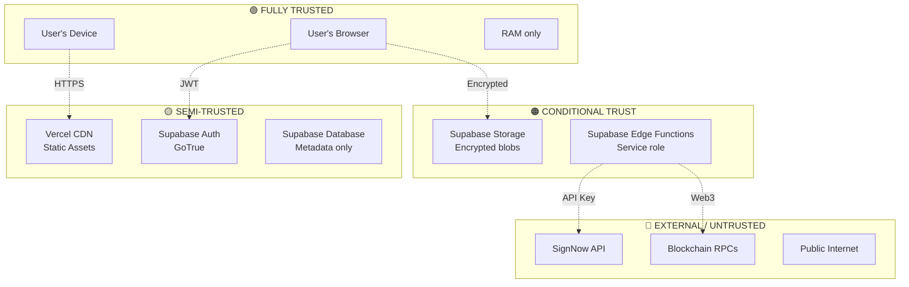
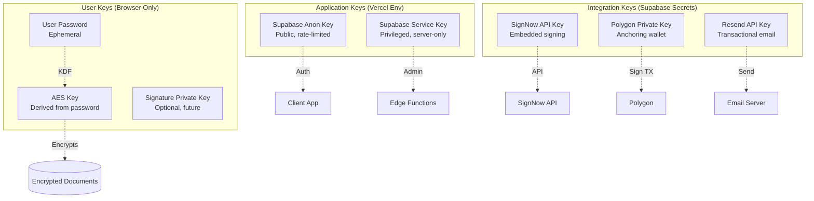
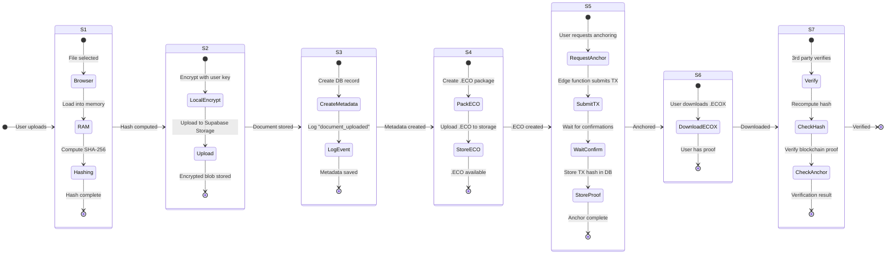

# 🛡️ Trust Boundaries & Chain of Custody

**Version:** 1.0  
**Last Updated:** 2025-12-16  
**Related:** [ARCHITECTURE.md](./ARCHITECTURE.md), [SECURITY.md](../SECURITY.md)

---

## 📋 Table of Contents

1. [Trust Model Overview](#trust-model-overview)
2. [Trust Zones](#trust-zones)
3. [Key Distribution](#key-distribution)
4. [Chain of Custody](#chain-of-custody)
5. [Tamper Evidence](#tamper-evidence)
6. [Threat Model](#threat-model)

---

## 🎯 Trust Model Overview

EcoSign implements a **"Deliberately Blind"** architecture:

> **"Pensá en EcoSign como alguien que acompaña, pero que es ciego."**

### Core Principles

1. **Zero-Knowledge Document Content**
   - We NEVER see the actual document
   - Only cryptographic hashes are processed server-side
   - Original documents encrypted client-side before storage (if stored)

2. **Client-Side Privacy**
   - Hashing happens in user's browser
   - Private keys never leave user's device
   - Encryption/decryption in browser memory only

3. **Verifiable Proofs**
   - Blockchain anchors provide immutable timestamps
   - Anyone can verify without EcoSign account
   - No trust required in EcoSign servers for verification

4. **Minimal Data Collection**
   - Only metadata necessary for functionality
   - No analytics on document content
   - Audit logs for security, not surveillance

---

## 🏰 Trust Zones

### Zone Classification



### Zone Details

#### 🟢 Zone 1: Fully Trusted (User's Device)

**Components:**
- User's web browser
- JavaScript execution context
- Browser's Web Crypto API
- Temporary memory (RAM)

**What Happens Here:**
- Original document loaded into memory
- SHA-256 hash computed
- Document encrypted (if storing)
- Private signature applied
- .ECO package created

**Attack Surface:**
- XSS (mitigated by CSP + React escaping)
- Malicious browser extensions
- Compromised device
- MITM on initial page load

**Mitigation:**
- Content Security Policy (CSP)
- Subresource Integrity (SRI)
- HTTPS everywhere + HSTS
- Code minification + obfuscation

---

#### 🟡 Zone 2: Semi-Trusted (Supabase Infrastructure)

**Components:**
- PostgreSQL database (metadata only)
- GoTrue authentication service
- Supabase API endpoints

**What Happens Here:**
- User authentication (email/password)
- JWT token generation
- Metadata storage (filename, hash, user_id)
- Row Level Security (RLS) enforcement
- Audit event logging

**What They CAN See:**
- User email
- Document metadata (filename, size, upload timestamp)
- Document hashes (SHA-256 strings)
- Blockchain anchor references (tx hashes)

**What They CANNOT See:**
- Document content
- Decryption keys
- User passwords (hashed with bcrypt)

**Attack Surface:**
- SQL injection (mitigated by parameterized queries)
- Privilege escalation (mitigated by RLS)
- Insider threat (access logs + audit)

**Mitigation:**
- Row Level Security (RLS) on all tables
- Service role key separation
- Encrypted connections (TLS 1.3)
- Regular security audits

---

#### 🟠 Zone 3: Conditional Trust (Encrypted Storage)

**Components:**
- Supabase Storage buckets
- S3-compatible object storage
- Signed URL generation

**What Happens Here:**
- Encrypted document blobs stored
- .ECO files stored (plaintext but hash-only)
- Signature images stored (PNG)
- Temporary file management

**Encryption:**
```typescript
// Client-side encryption before upload
const key = await deriveKey(userPassword, salt);
const encrypted = await encrypt(documentBuffer, key);
await supabase.storage.from('documents').upload(path, encrypted);
```

**What They CAN See:**
- Encrypted blobs (unintelligible without key)
- .ECO files (hash + timestamp + proof only)
- File sizes, upload times

**What They CANNOT See:**
- Original document content (encrypted)
- Encryption keys (never uploaded)

**Attack Surface:**
- Storage bucket misconfiguration
- Signed URL leakage
- Brute-force decryption (mitigated by AES-256-GCM)

**Mitigation:**
- All buckets set to **private**
- Signed URLs with 15-minute expiration
- AES-256-GCM encryption
- Bucket-level RLS policies

---

#### 🔴 Zone 4: External / Untrusted

**Components:**
- SignNow API (signature workflows)
- Blockchain RPC nodes (Polygon, Bitcoin)
- Email service (Resend)
- Public internet

**What Happens Here:**
- Document sent to SignNow for embedded signing
- Blockchain transactions submitted
- Email notifications sent
- Public .ECOX verification

**Trust Model:**
- **SignNow:** Trusted for signature workflow ONLY
  - We send PDF + signer info
  - They return signed PDF
  - No permanent storage assumed
  
- **Blockchain RPCs:** Untrusted
  - We verify tx confirmations from multiple nodes
  - Open-source smart contracts
  
- **Email:** Untrusted
  - Only send notifications, no sensitive data
  - Links expire after 7 days

**Attack Surface:**
- API compromise (SignNow breach)
- RPC node manipulation (51% attack)
- Email interception (phishing)

**Mitigation:**
- API key rotation
- Multi-node verification for blockchain
- Email links with expiration + HMAC signature
- HTTPS + DKIM on emails

---

## 🔑 Key Distribution

### Key Hierarchy



### Key Access Matrix

| Key | Stored Where | Who Has Access | Purpose | Rotation |
|-----|--------------|----------------|---------|----------|
| **User Password** | User's memory | User only | Derive encryption key | User-initiated |
| **AES Encryption Key** | Derived on-the-fly | User's browser (ephemeral) | Encrypt/decrypt documents | Per-session |
| **Supabase Anon Key** | Vercel env + Client code | Public (rate-limited) | Auth + read own data | Manual (rarely) |
| **Supabase Service Key** | Vercel env (secret) | Edge Functions only | Write system events | Manual (6 months) |
| **SignNow API Key** | Supabase secrets | Edge Functions only | Create/manage docs | Manual (1 year) |
| **Polygon Private Key** | Supabase secrets | Edge Functions only | Submit anchor txs | Manual (1 year) |
| **Resend API Key** | Supabase secrets | Edge Functions only | Send emails | Manual (1 year) |

### Key Rotation Procedures

See [KEY_ROTATION_PLAN.md](./KEY_ROTATION_PLAN.md) for detailed procedures.

**Quick Reference:**

1. **User Password:** User can change anytime (re-encrypts stored docs)
2. **Supabase Keys:** Rotate via Supabase dashboard + update Vercel env
3. **API Keys:** Rotate via provider dashboard + update Supabase secrets
4. **Blockchain Keys:** Create new wallet, fund it, update contract, phase out old

---

## 📜 Chain of Custody

### Detailed Document Lifecycle



### Custody Point Details

#### Stage 1: Upload (User's Browser)

**Who Controls:** User  
**Location:** Client browser RAM  
**Data Exposed:** Full document  
**Actions Possible:**
- ✅ Read document
- ✅ Compute SHA-256 hash
- ✅ Encrypt with AES-256-GCM
- ✅ Delete from memory
- ❌ Cannot be recovered by EcoSign

**Audit:**
```json
{
  "event_type": "document_selected",
  "timestamp": "2025-12-16T12:00:00Z",
  "metadata": {
    "filename": "contract.pdf",
    "size": 524288,
    "type": "application/pdf"
  },
  "ip": null,  // Not logged (privacy)
  "user_agent": "Mozilla/5.0..."
}
```

---

#### Stage 2: Hashing (Client-Side)

**Who Controls:** Web Crypto API (browser)  
**Location:** Browser memory  
**Data Exposed:** Original document (ephemeral)  
**Actions Possible:**
- ✅ SHA-256 hash generation
- ✅ Hash displayed to user
- ❌ Hash NOT sent to server yet

**Cryptographic Proof:**
```
SHA-256(contract.pdf) = e3b0c44298fc1c149afbf4c8996fb92427ae41e4649b934ca495991b7852b855
```

**Audit:**
```json
{
  "event_type": "document_hashed",
  "timestamp": "2025-12-16T12:00:01Z",
  "metadata": {
    "hash_algorithm": "SHA-256",
    "hash": "e3b0c442...",  // First 8 chars only in logs
    "computed_client_side": true
  }
}
```

---

#### Stage 3: Encryption & Storage (Optional)

**Who Controls:** User (chooses to store or not)  
**Location:** Supabase Storage bucket (`documents/`)  
**Data Exposed:** Encrypted blob only  
**Actions Possible:**
- ✅ Store encrypted document
- ✅ Generate signed URL for download
- ❌ CANNOT decrypt without user's key

**Encryption Details:**
```typescript
// Client-side encryption
const salt = crypto.getRandomValues(new Uint8Array(16));
const key = await crypto.subtle.importKey(
  'raw',
  await crypto.subtle.digest('SHA-256', userPassword + salt),
  { name: 'AES-GCM', length: 256 },
  false,
  ['encrypt', 'decrypt']
);

const iv = crypto.getRandomValues(new Uint8Array(12));
const encrypted = await crypto.subtle.encrypt(
  { name: 'AES-GCM', iv },
  key,
  documentBuffer
);

// Upload: salt + iv + encrypted
const blob = new Blob([salt, iv, encrypted]);
```

**Audit:**
```json
{
  "event_type": "document_stored",
  "timestamp": "2025-12-16T12:00:02Z",
  "metadata": {
    "storage_bucket": "documents",
    "encrypted": true,
    "encryption_algorithm": "AES-256-GCM",
    "size_encrypted": 524544  // Slightly larger due to IV + auth tag
  }
}
```

---

#### Stage 4: .ECO Package Creation

**Who Controls:** Client (with eco-packer library)  
**Location:** Browser memory → Supabase Storage (`eco-files/`)  
**Data Exposed:** Hash + timestamp + metadata ONLY  
**Actions Possible:**
- ✅ Create tamper-evident package
- ✅ Add signature (future: cryptographic signature)
- ✅ Store plaintext .ECO (no secrets)

**.ECO Structure:**
```json
{
  "version": "1.0.0",
  "timestamp": 1734357600,
  "documentHash": "e3b0c44298fc1c149afbf4c8996fb92427ae41e4649b934ca495991b7852b855",
  "signature": null,  // Future: digital signature
  "anchors": null,    // Added later
  "metadata": {
    "filename": "contract.pdf",
    "fileType": "application/pdf",
    "fileSize": 524288,
    "userId": "uuid-here"
  }
}
```

**Audit:**
```json
{
  "event_type": "eco_created",
  "timestamp": "2025-12-16T12:00:03Z",
  "metadata": {
    "eco_version": "1.0.0",
    "has_signature": false,
    "has_anchors": false
  }
}
```

---

#### Stage 5: Blockchain Anchoring

**Who Controls:** Supabase Edge Function (with service role)  
**Location:** Polygon blockchain  
**Data Exposed:** Document hash ONLY (public on-chain)  
**Actions Possible:**
- ✅ Submit hash to smart contract
- ✅ Verify tx confirmation
- ✅ Store TX hash in DB
- ❌ CANNOT reverse hash to document

**Smart Contract Call:**
```solidity
// Polygon smart contract (simplified)
function anchorDocument(bytes32 documentHash) public {
    require(!anchors[documentHash].exists, "Already anchored");
    
    anchors[documentHash] = Anchor({
        timestamp: block.timestamp,
        blockNumber: block.number,
        exists: true
    });
    
    emit DocumentAnchored(documentHash, msg.sender, block.timestamp);
}
```

**Blockchain Proof:**
```json
{
  "txHash": "0xabc123...",
  "blockNumber": 12345678,
  "timestamp": 1734357605,
  "confirmations": 12,
  "gasUsed": 45000,
  "documentHash": "e3b0c44298fc1c149afbf4c8996fb92427ae41e4649b934ca495991b7852b855"
}
```

**Audit:**
```json
{
  "event_type": "document_anchored",
  "timestamp": "2025-12-16T12:00:10Z",
  "metadata": {
    "network": "polygon",
    "tx_hash": "0xabc123...",
    "block_number": 12345678,
    "confirmations": 12
  }
}
```

---

#### Stage 6: Download .ECOX

**Who Controls:** User  
**Location:** User's device  
**Data Exposed:** .ECO + blockchain proof  
**Actions Possible:**
- ✅ Download self-contained proof package
- ✅ Share with 3rd parties
- ✅ Verify without EcoSign

**.ECOX Structure:**
```json
{
  "version": "1.0.0",
  "timestamp": 1734357600,
  "documentHash": "e3b0c442...",
  "signature": null,
  "anchors": {
    "polygon": {
      "txHash": "0xabc123...",
      "blockNumber": 12345678,
      "timestamp": 1734357605,
      "network": "amoy"
    }
  },
  "metadata": {
    "filename": "contract.pdf",
    "fileType": "application/pdf",
    "fileSize": 524288
  }
}
```

**Audit:**
```json
{
  "event_type": "ecox_downloaded",
  "timestamp": "2025-12-16T12:01:00Z",
  "metadata": {
    "has_blockchain_proof": true,
    "download_method": "browser"
  }
}
```

---

#### Stage 7: Verification (3rd Party)

**Who Controls:** Anyone with .ECOX file  
**Location:** Verifier's device  
**Data Exposed:** Hash + proof (verifier already has document)  
**Actions Possible:**
- ✅ Recompute hash of document
- ✅ Compare with .ECOX hash
- ✅ Verify blockchain TX on explorer
- ✅ Confirm timestamp

**Verification Process:**
```typescript
// Verifier's code (can be offline)
const computedHash = await sha256(documentFile);
const ecoPackage = JSON.parse(ecoxFile);

// Step 1: Hash match
if (computedHash !== ecoPackage.documentHash) {
  return { valid: false, reason: "Hash mismatch - document tampered" };
}

// Step 2: Blockchain verification (online)
const txData = await polygonProvider.getTransaction(ecoPackage.anchors.polygon.txHash);
if (!txData) {
  return { valid: false, reason: "Blockchain TX not found" };
}

// Step 3: Timestamp check
if (txData.timestamp !== ecoPackage.anchors.polygon.timestamp) {
  return { valid: false, reason: "Timestamp mismatch" };
}

return {
  valid: true,
  timestamp: ecoPackage.timestamp,
  blockNumber: txData.blockNumber,
  confirmations: currentBlock - txData.blockNumber
};
```

**Audit:**
```json
{
  "event_type": "document_verified",
  "timestamp": "2025-12-16T15:00:00Z",
  "metadata": {
    "verification_method": "blockchain",
    "result": "valid",
    "verifier_ip": null  // Privacy: not logged
  }
}
```

---

## 🚨 Tamper Evidence

### Tamper Detection Mechanisms

#### 1. Cryptographic Hashing

**Mechanism:** SHA-256 creates unique fingerprint

```
Original:  "Hello World" → SHA-256 → a591a6d40bf420404a011733cfb7b190d62c65bf0bcda32b57b277d9ad9f146e
Modified:  "Hello World!" → SHA-256 → 7f83b1657ff1fc53b92dc18148a1d65dfc2d4b1fa3d677284addd200126d9069
                                                     ↑ Completely different!
```

**Detection:** Any modification (even 1 bit) changes entire hash.

#### 2. Blockchain Immutability

**Mechanism:** Hash stored on-chain cannot be altered

```
Block N:   [prev_hash][tx_hash][timestamp][nonce]
            ↓
Block N+1: [hash_of_block_N][tx_hash][timestamp][nonce]
            ↓
Block N+2: [hash_of_block_N+1][...]
```

**Detection:** Changing any past block requires recomputing entire chain (computationally infeasible).

#### 3. Timestamp Proof

**Mechanism:** Blockchain timestamp proves document existed at specific time

```
Document created:  2025-12-16 12:00:00 (claimed)
Blockchain TX:     2025-12-16 12:00:10 (provable)
                   ↓
Document MUST have existed before 12:00:10
```

**Detection:** Back-dating impossible (blockchain timestamp is immutable).

#### 4. Multi-Layer Verification

**Mechanism:** Multiple independent proofs

```
Layer 1: SHA-256 hash (cryptographic)
Layer 2: Blockchain anchor (decentralized)
Layer 3: Smart contract event (immutable log)
Layer 4: Multiple RPC nodes (no single point of truth)
```

**Detection:** Attacker must compromise ALL layers simultaneously.

---

## 🎯 Threat Model

### Assumed Threats

#### T1: Document Tampering After Certification

**Attack:** User modifies document after getting .ECOX, tries to pass off as original.

**Mitigation:**
- Hash verification fails immediately
- Blockchain proof still points to old hash
- Verifier sees mismatch

**Detection:** Automatic during verification

---

#### T2: Backdated Document

**Attack:** User creates document today, tries to prove it existed last year.

**Mitigation:**
- Blockchain timestamp is immutable
- Can only prove "existed before TX timestamp"
- Cannot prove "existed earlier than reality"

**Detection:** Check blockchain explorer for TX timestamp

---

#### T3: EcoSign Server Compromise

**Attack:** Attacker gains access to Supabase infrastructure.

**Impact:**
- Can see encrypted document blobs (but not decrypt)
- Can see metadata (filename, user emails)
- Can see document hashes
- CANNOT see original documents
- CANNOT modify past blockchain anchors

**Mitigation:**
- Encryption keys never stored
- Blockchain proofs immutable
- RLS limits data access
- Audit logs track admin actions

**Detection:** Monitoring + alerts on suspicious queries

---

#### T4: Blockchain 51% Attack

**Attack:** Attacker controls majority of Polygon validators, rewrites history.

**Impact:**
- Could theoretically alter past transactions
- Extremely expensive (billions of dollars)
- Would be detected by community

**Mitigation:**
- Use Bitcoin as backup (more secure)
- Multi-chain anchoring
- Wait for many confirmations (12+)

**Detection:** Blockchain monitoring, community alerts

---

#### T5: SignNow Compromise

**Attack:** SignNow servers breached, attacker accesses documents in signing workflow.

**Impact:**
- Attacker can see documents sent for signing
- Can see signer emails
- CANNOT alter already-signed documents
- CANNOT access documents only certified (not sent to SignNow)

**Mitigation:**
- Use SignNow only for workflows that require it
- Sensitive docs: use "Mi Firma" (client-only)
- Monitor SignNow security advisories

**Detection:** SignNow notifies of breaches

---

### Trust Assumptions

**We TRUST:**
- ✅ User's browser (no malware)
- ✅ Web Crypto API (correct implementation)
- ✅ Blockchain consensus (PoS honest majority)
- ✅ SHA-256 collision resistance

**We DO NOT TRUST:**
- ❌ EcoSign servers (designed to be blind)
- ❌ SignNow (only used when necessary)
- ❌ Individual RPC nodes (use multiple)
- ❌ Storage providers (encrypt at rest)

---

## 📚 Related Documentation

- [ARCHITECTURE.md](./ARCHITECTURE.md) - Full system architecture
- [SECURITY.md](../SECURITY.md) - Security policies
- [KEY_ROTATION_PLAN.md](./KEY_ROTATION_PLAN.md) - Key management
- [DEPLOYMENT.md](./DEPLOYMENT.md) - Deploy procedures

---

**Document Version:** 1.0  
**Last Review:** 2025-12-16  
**Next Review:** After security audit  
**Maintainer:** EcoSign Security Team
