# 🏗️ EcoSign Architecture

**Version:** 2.0  
**Last Updated:** 2025-12-16  
**Status:** Pre-MVP / Private Beta

---

## 📋 Table of Contents

1. [High-Level Overview](#high-level-overview)
2. [System Architecture](#system-architecture)
3. [Component Breakdown](#component-breakdown)
4. [Data Flow](#data-flow)
5. [Signature Workflow](#signature-workflow)
6. [Storage Architecture](#storage-architecture)
7. [Security Model](#security-model)
8. [Trust Boundaries](#trust-boundaries)
9. [Chain of Custody](#chain-of-custody)
10. [Deployment Architecture](#deployment-architecture)
11. [Technology Stack](#technology-stack)

---

## 🎯 High-Level Overview

EcoSign is a **JAMStack application** for document certification and digital signatures with blockchain anchoring capabilities.

### Core Principles

1. **Single Frontend**: All user experiences in one Vite/React SPA
2. **Serverless Backend**: Supabase handles auth, DB, storage, functions
3. **Shared Logic**: `eco-packer` library for .ECO/.ECOX format
4. **Privacy First**: Client-side hashing, encrypted storage
5. **Blockchain Agnostic**: Supports Polygon, Bitcoin (via OpenTimestamps)
6. **SignNow Integration**: Professional signing workflows via embedded SDK

---

## 🏛️ System Architecture

### Deployment Overview

```mermaid
graph TB
    User[👤 User Browser]
    Vercel[Vercel CDN]
    Client[React SPA<br/>client/dist]
    Supabase[Supabase Platform]
    SignNow[SignNow API]
    Polygon[Polygon Network]
    Bitcoin[Bitcoin Network<br/>via OTS]
    
    User -->|HTTPS| Vercel
    Vercel -->|Serves| Client
    Client -->|Auth/API| Supabase
    Client -->|Embed SDK| SignNow
    Supabase -->|Anchoring| Polygon
    Supabase -->|Anchoring| Bitcoin
    
    subgraph "Vercel (CDN + Edge)"
        Client
    end
    
    subgraph "Supabase (BaaS)"
        DB[(PostgreSQL)]
        Storage[(Object Storage)]
        Functions[Edge Functions]
        Auth[Auth Service]
    end
    
    Supabase --> DB
    Supabase --> Storage
    Supabase --> Functions
    Supabase --> Auth
```



### Logical Architecture


---

## 🧩 Component Breakdown

### 1. Client Application (`client/`)

**Purpose:** Single-page application serving all user interfaces

**Technology:** Vite + React 18 + React Router 6

**Key Modules:**

```
client/src/
├── components/          # Reusable UI components
│   ├── LegalCenterModal.jsx    # Core signing/certification flow
│   ├── VerifyModal.jsx          # Document verification
│   └── SignatureCanvas.jsx      # Draw/type/upload signature
├── pages/               # Route components
│   ├── LandingPage.jsx
│   ├── DashboardPage.jsx
│   └── DocumentsPage.jsx
├── lib/                 # Service integrations
│   ├── supabaseClient.js        # Supabase setup
│   ├── basicCertificationWeb.js # Client-side certification
│   ├── signNowService.js        # SignNow SDK integration
│   ├── polygonAnchor.js         # Polygon anchoring
│   └── bitcoinOTS.js            # OpenTimestamps
├── utils/               # Pure functions
│   ├── hashDocument.ts          # SHA-256 hashing
│   ├── pdfSignature.js          # PDF manipulation
│   ├── encryption.ts            # AES-256-GCM
│   └── eventLogger.js           # Audit trail
└── hooks/               # React hooks
    └── useLegalCenterGuide.js   # Onboarding guide
```

**Responsibilities:**
- User authentication UI
- Document upload & preview
- Client-side hashing (SHA-256)
- Signature creation (draw/type/upload)
- Workflow orchestration
- Certificate verification
- Download management

**Does NOT:**
- Store private keys
- Process payments (future)
- Edit PDFs directly (delegated to SignNow)
- Store documents unencrypted

---

### 2. Shared Package (`eco-packer/`)

**Purpose:** Pure TypeScript library for .ECO/.ECOX format handling

**Format Specification:**

```typescript
interface EcoPackage {
  version: string;           // Format version (e.g., "1.0.0")
  timestamp: number;         // Unix timestamp
  documentHash: string;      // SHA-256 hash of document
  signature: string;         // Digital signature
  anchors?: {
    polygon?: {
      txHash: string;
      blockNumber: number;
      timestamp: number;
    };
    bitcoin?: {
      otsFile: string;       // Base64-encoded OTS file
      merkleRoot: string;
    };
  };
  metadata: {
    filename: string;
    fileType: string;
    fileSize: number;
    userId: string;
  };
}
```

**Key Functions:**
- `packEco(data: EcoData): Buffer` - Create .ECO file
- `unpackEco(buffer: Buffer): EcoPackage` - Parse .ECO file
- `verifyEco(eco: EcoPackage, originalFile: Buffer): boolean` - Verify integrity
- `addAnchor(eco: EcoPackage, anchor: Anchor): EcoPackage` - Add blockchain proof

**Usage:**
```typescript
// Client-side verification
import { unpackEco, verifyEco } from 'eco-packer';

const ecoBuffer = await file.arrayBuffer();
const eco = unpackEco(Buffer.from(ecoBuffer));
const isValid = verifyEco(eco, originalDocument);
```

---

### 3. Supabase Backend (`supabase/`)

**Purpose:** Backend-as-a-Service providing auth, database, storage, functions

#### Database Schema (Core Tables)

```sql
-- Users (managed by Supabase Auth)
auth.users (
  id uuid PRIMARY KEY,
  email text,
  created_at timestamp
)

-- Documents
public.user_documents (
  id uuid PRIMARY KEY,
  user_id uuid REFERENCES auth.users,
  original_filename text,
  file_hash text,              -- SHA-256 of original
  file_type text,
  file_size integer,
  ecox_hash text,              -- SHA-256 of .ECOX
  eco_file_data jsonb,         -- ECO metadata
  overall_status text,         -- 'pending', 'certified', 'anchored'
  bitcoin_status text,         -- 'pending', 'confirmed', 'failed'
  download_enabled boolean,
  created_at timestamp,
  updated_at timestamp
)

-- Anchors (Blockchain proofs)
public.anchors (
  id uuid PRIMARY KEY,
  document_id uuid REFERENCES user_documents,
  network text,                -- 'polygon' | 'bitcoin'
  tx_hash text,
  block_number integer,
  confirmed_at timestamp,
  metadata jsonb
)

-- Signature Workflows
public.signature_workflows (
  id uuid PRIMARY KEY,
  document_id uuid,
  signnow_document_id text,
  status text,                 -- 'draft', 'pending', 'completed'
  created_by uuid REFERENCES auth.users,
  invites jsonb                -- Array of signer invites
)

-- Events (Audit trail)
public.events (
  id uuid PRIMARY KEY,
  document_id uuid,
  user_id uuid,
  event_type text,             -- From EVENT_TYPES constant
  ip_address inet,
  user_agent text,
  metadata jsonb,
  created_at timestamp
)
```

#### Row Level Security (RLS)

**Policy:** Users can ONLY access their own documents

```sql
-- Example: user_documents table
CREATE POLICY "Users can view their own documents"
  ON public.user_documents FOR SELECT
  USING (auth.uid() = user_id);

CREATE POLICY "Users can insert their own documents"
  ON public.user_documents FOR INSERT
  WITH CHECK (auth.uid() = user_id);
```

**Service Role:** Edge functions use `service_role` key for privileged operations

#### Edge Functions

**Location:** `supabase/functions/`

**Key Functions:**

1. **`anchor-polygon`**
   - Writes document hash to Polygon smart contract
   - Stores tx hash in DB
   - Returns proof

2. **`anchor-bitcoin`** (future)
   - Generates OpenTimestamps proof
   - Stores OTS file in storage
   - Returns merkle root

3. **`webhook-signnow`**
   - Receives SignNow webhook events
   - Updates workflow status
   - Notifies users

#### Storage Buckets

```
supabase/storage/
├── documents/           # Original uploaded documents (encrypted)
├── eco-files/           # Generated .ECO/.ECOX files
└── signatures/          # Signature images (draw/upload)
```

**Access Control:**
- All buckets are **private**
- Signed URLs with 15-minute expiration
- RLS policies enforce user isolation

---

## 🔄 Data Flow

### Document Certification Flow


### Signature Workflow Flow


---

## ✍️ Signature Workflow

### SignNow Integration Architecture


### Workflow States


**States:**
- `draft` - Workflow created, not sent
- `pending` - Invites sent, awaiting signatures
- `partial_signed` - Some signers completed
- `completed` - All signatures collected
- `expired` - Invite timeout (30 days)
- `cancelled` - Owner cancelled

---

## 💾 Storage Architecture

### Data at Rest


### Encryption Strategy

**Documents:**
- Encrypted client-side with AES-256-GCM
- Key derived from user password + salt
- Encrypted blob uploaded to Supabase Storage
- Decryption only happens in user's browser

**.ECO Files:**
- NOT encrypted (designed to be shared/verified)
- Contains only hash + timestamp + proof
- Original document NOT included

**Signatures:**
- PNG images from canvas/upload
- Stored as-is in private bucket
- Applied to PDF via PDF-lib library

---

## 🔒 Security Model

### Authentication Flow


### Security Headers

Configured in `vercel.json`:

```json
{
  "headers": [
    {
      "source": "/(.*)",
      "headers": [
        {
          "key": "Strict-Transport-Security",
          "value": "max-age=63072000; includeSubDomains; preload"
        },
        {
          "key": "Content-Security-Policy",
          "value": "default-src 'self'; script-src 'self' 'unsafe-inline' 'unsafe-eval' https://cdn.signnow.com; ..."
        },
        {
          "key": "X-Frame-Options",
          "value": "DENY"
        },
        {
          "key": "X-Content-Type-Options",
          "value": "nosniff"
        },
        {
          "key": "Referrer-Policy",
          "value": "strict-origin-when-cross-origin"
        },
        {
          "key": "Permissions-Policy",
          "value": "camera=(), microphone=(), geolocation=()"
        }
      ]
    }
  ]
}
```

### Threat Model

**Protected Against:**
- ✅ SQL Injection (Supabase parameterized queries)
- ✅ XSS (React auto-escaping + CSP)
- ✅ CSRF (SameSite cookies + JWT in Authorization header)
- ✅ Unauthorized access (RLS policies)
- ✅ Document tampering (SHA-256 hashes + blockchain anchoring)
- ✅ MITM (HTTPS everywhere + HSTS)

**Known Limitations:**
- ⚠️ No key rotation (keys stored in Vercel env vars)
- ⚠️ No KMS (secrets in environment variables)
- ⚠️ No rate limiting on API endpoints (Supabase handles, but not custom)
- ⚠️ No WAF (relying on Vercel/Supabase infrastructure)

---

## 🛡️ Trust Boundaries

### Boundary Map


### Key Distribution

| Component | Has Access To | Purpose |
|-----------|---------------|---------|
| **User Browser** | User password (ephemeral) | Decrypt own documents |
| **Client App** | Supabase anon key (public) | Auth + read own data |
| **Edge Functions** | Supabase service_role key | Write system events |
| **Edge Functions** | SignNow API key | Create/manage documents |
| **Edge Functions** | Polygon private key | Submit anchor txs |

**Critical:** Private keys for blockchain anchoring stored in Supabase secrets (encrypted at rest).

---

## 📜 Chain of Custody

### Document Lifecycle


### Custody Points

| Stage | Who Controls | What They See | What They Can Do |
|-------|--------------|---------------|------------------|
| **Upload** | User | Full document | Hash, encrypt, upload |
| **Storage** | Supabase | Encrypted blob | Store, delete (admin) |
| **Hashing** | User's browser | Full document | Compute SHA-256 |
| **Certification** | Client + Supabase | Hash only | Create .ECO package |
| **Anchoring** | Edge Function | Hash only | Submit to blockchain |
| **Verification** | Anyone | .ECOX file + Hash | Verify integrity |

**Key Principle:** EcoSign is "deliberately blind" - we never see document contents, only hashes.

---

## 🚀 Deployment Architecture

### Production Setup


### Environments

| Environment | URL | Purpose | DB | Secrets |
|-------------|-----|---------|----|---------| 
| **Production** | ecosign.com | Live users | Supabase prod | Vercel env vars |
| **Staging** | staging.ecosign.com | Pre-release testing | Supabase staging | Vercel preview |
| **Local** | localhost:5173 | Development | Supabase local | .env.local |

### Deployment Process

1. **Code pushed to GitHub** (`main` branch)
2. **Vercel auto-deploys**
   - Builds `client/` with Vite
   - Deploys to global CDN
   - ~2-3 minutes
3. **Supabase migrations** (manual)
   - Run via Supabase CLI
   - Applied to prod DB
4. **Edge Functions** (manual)
   - `supabase functions deploy <name>`
   - Deployed individually

---

## 🛠️ Technology Stack

### Frontend
- **Framework:** React 18.3.1
- **Build Tool:** Vite 6.0
- **Router:** React Router 6.28
- **Styling:** Tailwind CSS 3.4
- **State:** React hooks (no Redux)
- **Notifications:** react-hot-toast
- **PDF:** PDF-lib, pdfjs-dist
- **Crypto:** Web Crypto API, noble-hashes

### Backend
- **BaaS:** Supabase (PostgreSQL + Storage + Auth + Functions)
- **Edge Functions:** Deno (TypeScript)
- **Database:** PostgreSQL 15
- **Auth:** GoTrue (OAuth2 + JWT)
- **Storage:** S3-compatible object storage

### Blockchain
- **Polygon:** ethers.js 6.x
- **Bitcoin:** OpenTimestamps (OTS)
- **Networks:**
  - Polygon Amoy (testnet)
  - Bitcoin (mainnet via OTS servers)

### Integrations
- **Signatures:** SignNow API + Embed SDK
- **Email:** Resend (transactional emails)
- **Analytics:** Vercel Analytics (Web Vitals)
- **Monitoring:** (Sentry planned - Sprint 2)

### DevOps
- **Hosting:** Vercel (CDN + Edge)
- **CI/CD:** GitHub Actions
- **Package Manager:** npm 10.x
- **Testing:** Vitest 4.0
- **Linting:** ESLint 9.x
- **Formatting:** Prettier 3.x

---

## 🔮 Future Architecture Considerations

### Planned Improvements (Post-MVP)

1. **Key Management Service (KMS)**
   - Move blockchain private keys to AWS KMS / Cloud KMS
   - Implement key rotation

2. **Asynchronous Processing**
   - Move anchoring to queue (Inngest / BullMQ)
   - Improve UX with background jobs

3. **Caching Layer**
   - Add Redis for hot data
   - Reduce DB load

4. **Multi-Region**
   - Deploy Supabase to multiple regions
   - Latency optimization

5. **Smart Contract Upgrades**
   - Upgradeable proxy pattern
   - Gas optimization

---

## 📚 Related Documentation

- [DEPLOYMENT.md](./DEPLOYMENT.md) - Deploy procedures and runbooks
- [SECURITY.md](../SECURITY.md) - Security policies and incident response
- [SIGNATURE_WORKFLOW_ARCHITECTURE.md](./SIGNATURE_WORKFLOW_ARCHITECTURE.md) - SignNow integration details
- [POLYGON_ANCHORING_SETUP.md](./POLYGON_ANCHORING_SETUP.md) - Blockchain anchoring guide

---

**Document Version:** 2.0  
**Last Review:** 2025-12-16  
**Next Review:** After MVP launch  
**Maintainer:** EcoSign Dev Team
