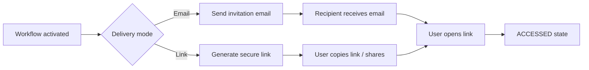

# Delivery Mode — Email vs Link
Fecha: 2026-01-12T17:33:37.144Z

Descripción
-----------
Modalidades de entrega del access token. Ambas convergen al mismo flujo de firma (ACCESSED).

Mermaid (flowchart)
--------------------

Notas rápidas
-------------
- OTP es factor adicional y no debe estar embebido como única protección en el link.
- Delivery mode solo determina cómo se entrega el token, no cambia reglas de evidencia ni estados.

Nota adicional
---------------
- Delivery mode may be changed while workflow is ACTIVE, provided the signer has not signed.
