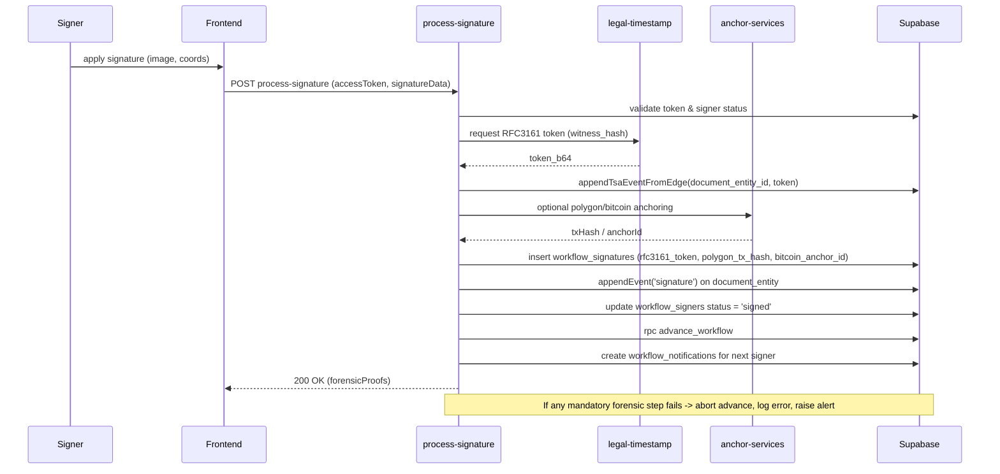

# Signature & Forensic Sequence
Fecha: 2026-01-12T17:33:37.144Z

Convencion de eventos (Fase 1)
------------------------------
Las referencias a eventos en este documento deben interpretarse
segun la convencion canonica `kind + at + payload`.

Descripción
-----------
Secuencia canónica que debe ejecutarse cuando un firmante completa su firma. Requisito: no avanzar sin evidencia.

Mermaid (sequence diagram)
--------------------------

Notas rápidas
-------------
- Rule: advance_workflow only after workflow_signatures contains required evidence per forensicConfig.
- Log and alert on TSA/append failures; do not silently continue.

Nota adicional
---------------
- process-signature must be idempotent per signer and workflow to prevent duplicate evidence on retries.
