# Phase 4: Auth Integration - Implementation Guide

**Status:** ✅ Complete  
**Date:** 2025-12-22

---

## 📦 What's Included

### 1. Enhanced Auth Hook (`useAuthWithE2E.ts`)
Extends the standard auth hook with E2E session management:

```typescript
const { 
  user, 
  loading, 
  error, 
  e2eReady,        // ← NEW: E2E session status
  signIn, 
  signInWithOtp,   // ← NEW: Magic link support
  signUp, 
  signOut 
} = useAuthWithE2E();
```

**Features:**
- ✅ Automatically initializes E2E session on login
- ✅ Ensures `wrap_salt` exists for new users
- ✅ Clears session crypto on logout
- ✅ Handles token refresh without breaking session
- ✅ Provides `e2eReady` flag for UI

### 2. E2E Status Component (`E2EStatus.tsx`)
Visual indicator of E2E session status:

```typescript
<E2EStatus show={true} compact={false} />
```

**Modes:**
- **Compact:** Small indicator with dot + text
- **Full:** Detailed card with session info

**Use cases:**
- Development/debugging
- User dashboard
- Settings page

### 3. Example Login Page (`LoginPageExample.tsx`)
Complete working example showing:
- OTP (magic link) login
- Password login
- E2E session initialization
- Error handling
- Status indicator

---

## 🔄 How It Works

### Login Flow

```mermaid
sequenceDiagram
    participant U as User
    participant C as Component
    participant H as useAuthWithE2E
    participant S as Supabase Auth
    participant E as E2E Library

    U->>C: Clicks "Sign In"
    C->>H: signIn(email, password)
    H->>S: signInWithPassword()
    S-->>H: {user, session}
    
    Note over H: onAuthStateChange fires
    
    H->>E: ensureUserWrapSalt(userId)
    E->>S: Check/create profiles record
    H->>E: initializeSessionCrypto(userId)
    
    Note over E: Generates session secret (client-side)
    Note over E: Derives unwrap key
    
    E-->>H: ✅ Session ready
    H-->>C: e2eReady = true
    C->>U: Navigate to dashboard
```



### Logout Flow

```mermaid
sequenceDiagram
    participant U as User
    participant H as useAuthWithE2E
    participant E as E2E Library
    participant S as Supabase Auth

    U->>H: signOut()
    H->>E: clearSessionCrypto()
    
    Note over E: Zeros out session secret
    Note over E: Clears unwrap key
    
    E-->>H: ✅ Session cleared
    H->>S: signOut()
    S-->>H: ✅ Logged out
    H->>U: Redirect to login
```



---

## 🛠️ Integration Steps

### Step 1: Replace useAuth with useAuthWithE2E

**❌ Old:**
```typescript
import { useAuth } from '../hooks/useAuth';

function MyComponent() {
  const { user, signIn, signOut } = useAuth();
  // ...
}
```

**✅ New:**
```typescript
import { useAuthWithE2E } from '../hooks/useAuthWithE2E';

function MyComponent() {
  const { user, signIn, signOut, e2eReady } = useAuthWithE2E();
  
  // Optional: Check if E2E is ready before showing encrypted features
  if (user && !e2eReady) {
    return <div>Initializing encryption...</div>;
  }
  
  // ...
}
```

### Step 2: Update Login Page

**Minimal changes needed:**

```typescript
// Add e2eReady to destructuring
const { signIn, e2eReady } = useAuthWithE2E();

// Optional: Show status in dev
{import.meta.env.DEV && <E2EStatus show={true} compact={true} />}

// Optional: Wait for E2E before redirecting
const handleLogin = async () => {
  await signIn(email, password);
  
  // Give E2E a moment to initialize
  setTimeout(() => {
    if (e2eReady) {
      console.log('✅ E2E ready!');
    }
    navigate('/dashboard');
  }, 500);
};
```

### Step 3: Add E2E Status to Dashboard (Optional)

```typescript
import { E2EStatus } from '../components/E2EStatus';

function Dashboard() {
  return (
    <div>
      {/* Your dashboard content */}
      
      {/* Show E2E status in development */}
      {import.meta.env.DEV && (
        <E2EStatus show={true} compact={false} />
      )}
    </div>
  );
}
```

---

## 🧪 Testing

### Manual Test 1: Login Flow

1. **Clear browser data** (to simulate fresh login)
2. **Go to login page**
3. **Sign in with email/password**
4. **Open console**, should see:
   ```
   🔐 Initializing E2E session for user: abc123...
   ✅ E2E session initialized
   ```
5. **Check DB:**
   ```sql
   SELECT * FROM public.profiles WHERE user_id = 'your-user-id';
   ```
   Should have `wrap_salt` value

### Manual Test 2: Session Persistence

1. **Log in**
2. **Refresh page**
3. **Check console**, should see:
   ```
   🔐 Initializing E2E session for user: abc123...
   ✅ E2E session initialized
   ```
4. E2E session automatically re-initialized

### Manual Test 3: Logout

1. **Log in**
2. **Check E2E Status** → Should show "Active"
3. **Log out**
4. **Check console**, should see:
   ```
   🧹 Clearing E2E session
   ```
5. E2E session properly cleared

### Manual Test 4: Token Refresh

1. **Log in**
2. **Wait for token refresh** (usually ~50 minutes)
3. **Check console** for `TOKEN_REFRESHED` event
4. **E2E session should remain active** (not re-initialized)

---

## 🚨 Common Issues & Solutions

### Issue 1: "Failed to get user wrap salt"

**Cause:** User doesn't have a `profiles` record

**Solution:** The hook calls `ensureUserWrapSalt()` automatically. Check:
```sql
SELECT * FROM public.profiles WHERE user_id = 'user-id';
```

If missing, run:
```sql
INSERT INTO public.profiles (user_id, wrap_salt)
VALUES ('user-id', encode(gen_random_bytes(16), 'hex'));
```

### Issue 2: e2eReady stays false

**Cause:** Session initialization failed silently

**Solution:** Check browser console for errors. Common causes:
- RLS policy blocking profile access
- Network error
- Invalid user ID

### Issue 3: Session clears on page refresh

**Cause:** This is expected behavior (by design)

**Solution:** Session secrets are volatile. They re-initialize automatically on refresh using the user's `wrap_salt` from DB.

### Issue 4: Multiple initializations

**Cause:** Auth state changes firing multiple times

**Solution:** The hook checks `isSessionInitialized()` before re-initializing. This is normal and safe.

---

## 📝 Notes for Developers

### Why separate hook instead of modifying useAuth?

1. **Backward compatibility:** Existing code using `useAuth` still works
2. **Opt-in:** Components choose when to enable E2E
3. **Testability:** Easier to test E2E logic in isolation

### Why setTimeout before redirect?

E2E initialization is async. The 500ms gives it time to complete before showing encrypted features. Not strictly necessary, but improves UX.

### Why not throw if E2E fails?

We allow users to continue without E2E. They can still use unencrypted features. This prevents E2E issues from blocking login.

### Can I use both hooks?

Yes! You can use `useAuth` for basic auth and manually call E2E functions when needed. `useAuthWithE2E` is just a convenience wrapper.

---

## 🎯 Next Steps

Phase 5: UI Components for encrypted documents
- Upload with encryption toggle
- Download with decryption
- Share with OTP
- Document list with 🔒 badges

---

**Phase 4 Complete!** ✅

E2E sessions now initialize automatically on login and clear on logout.
