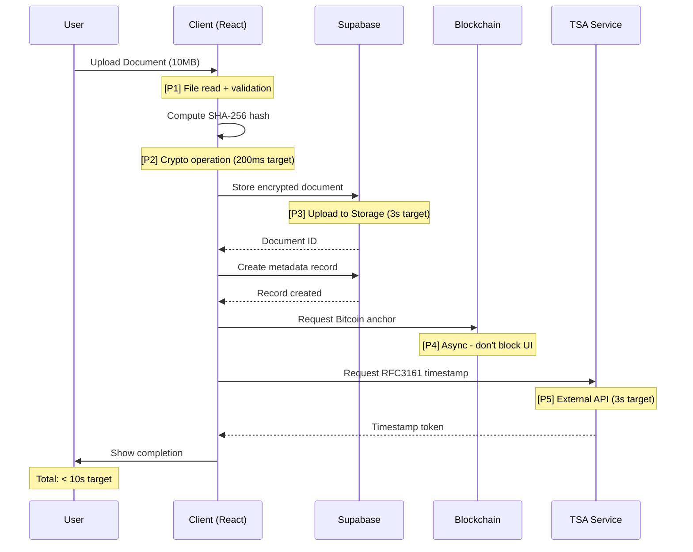
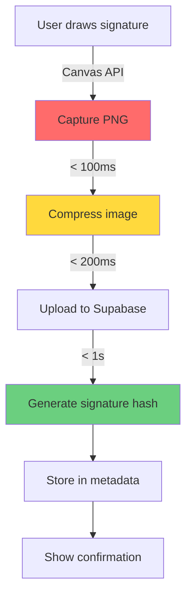
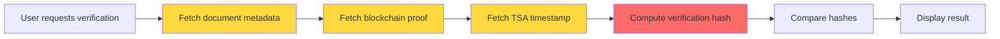

# Performance Engineering Guide

## Table of Contents
- [Overview](#overview)
- [Critical Path Analysis](#critical-path-analysis)
- [Performance Targets](#performance-targets)
- [Optimization Strategies](#optimization-strategies)
- [Monitoring & Profiling](#monitoring--profiling)
- [Load Testing](#load-testing)
- [Bottleneck Identification](#bottleneck-identification)
- [Caching Strategy](#caching-strategy)
- [Database Performance](#database-performance)
- [Frontend Performance](#frontend-performance)
- [Backend Performance](#backend-performance)
- [Network Optimization](#network-optimization)
- [Resource Management](#resource-management)
- [Performance Budget](#performance-budget)
- [Troubleshooting Guide](#troubleshooting-guide)

---

## Overview

### Performance Philosophy

EcoSign's performance strategy balances three competing concerns:

1. **Security** - Never sacrifice cryptographic integrity for speed
2. **User Experience** - Sub-second response for critical operations
3. **Cost Efficiency** - Optimize resource usage in serverless environment

**Golden Rule:** Optimize the critical path (document upload → signature → blockchain anchor) first. Everything else is secondary.

### Critical Performance Metrics

| Metric | Target | Critical | Current (Baseline) |
|--------|--------|----------|-------------------|
| Time to Interactive (TTI) | < 2s | < 3s | TBD (needs measurement) |
| Document Upload (10MB) | < 3s | < 5s | TBD |
| Signature Generation | < 500ms | < 1s | TBD |
| Hash Computation (10MB) | < 200ms | < 500ms | TBD |
| Blockchain Anchor Request | < 2s | < 5s | TBD |
| TSA Timestamping | < 3s | < 10s | TBD |
| Document Verification | < 1s | < 2s | TBD |
| Database Query (p95) | < 100ms | < 300ms | TBD |

**Status:** Baseline measurements needed. Use Web Vitals + custom instrumentation.

---

## Critical Path Analysis

### 1. Document Certification Flow (End-to-End)



**Performance Priorities (P1-P5):**
- **P1:** File validation (blocking) - must be < 1s
- **P2:** Hash computation (blocking) - critical for UX
- **P3:** Upload to Supabase (blocking) - network bottleneck
- **P4:** Blockchain anchor (async) - user doesn't wait
- **P5:** TSA timestamp (blocking) - external dependency

### 2. Signature Flow



**Bottlenecks:**
- Canvas → PNG conversion (unoptimized)
- Image upload without compression
- Multiple DB round-trips

### 3. Document Verification Flow



**Optimization:** Parallel fetch (B, C, D) instead of sequential.

---

## Performance Targets

### Web Vitals (Core Metrics)

| Metric | Good | Needs Improvement | Poor | EcoSign Target |
|--------|------|-------------------|------|----------------|
| **LCP** (Largest Contentful Paint) | ≤ 2.5s | 2.5-4s | > 4s | **≤ 2s** |
| **FID** (First Input Delay) | ≤ 100ms | 100-300ms | > 300ms | **≤ 50ms** |
| **CLS** (Cumulative Layout Shift) | ≤ 0.1 | 0.1-0.25 | > 0.25 | **≤ 0.05** |
| **INP** (Interaction to Next Paint) | ≤ 200ms | 200-500ms | > 500ms | **≤ 150ms** |
| **TTFB** (Time to First Byte) | ≤ 800ms | 800-1800ms | > 1800ms | **≤ 600ms** |

### Custom Metrics (Business-Critical)

| Operation | Target (p50) | Target (p95) | Target (p99) |
|-----------|--------------|--------------|--------------|
| Document hash (1MB) | 50ms | 150ms | 300ms |
| Document hash (10MB) | 200ms | 500ms | 1s |
| Signature upload | 300ms | 800ms | 1.5s |
| Blockchain anchor request | 500ms | 2s | 5s |
| TSA timestamp | 1s | 3s | 10s |
| Document list load | 200ms | 500ms | 1s |
| Centro Legal page load | 1s | 2s | 3s |

### Resource Budgets

| Resource Type | Budget | Critical Threshold |
|--------------|--------|-------------------|
| **JavaScript Bundle** | < 300KB gzipped | < 500KB |
| **CSS** | < 50KB gzipped | < 100KB |
| **Images** | < 200KB total (first load) | < 500KB |
| **Fonts** | < 100KB (preload) | < 200KB |
| **Total Page Weight** | < 1MB | < 2MB |
| **API Calls (first load)** | < 5 requests | < 10 |
| **Database Queries (p95)** | < 100ms | < 300ms |

---

## Optimization Strategies

### Frontend Optimizations

#### 1. Code Splitting & Lazy Loading

**Current State:** Monolithic bundle (assumption - needs verification)

**Strategy:**
```typescript
// Route-based code splitting
const CentroLegal = lazy(() => import('./pages/CentroLegal'));
const DocumentViewer = lazy(() => import('./components/DocumentViewer'));
const SignatureFlow = lazy(() => import('./components/SignatureFlow'));

// Component-level lazy loading for heavy dependencies
const PDFRenderer = lazy(() => import('./lib/pdfRenderer'));
```

**Expected Impact:** 40-60% reduction in initial bundle size

#### 2. Image Optimization

**Current Issue:** Signature canvas generates uncompressed PNG

**Solution:**
```typescript
// Convert canvas to compressed WebP (80% smaller than PNG)
async function optimizeSignatureImage(canvas: HTMLCanvasElement): Promise<Blob> {
  return new Promise((resolve) => {
    canvas.toBlob(
      (blob) => resolve(blob!),
      'image/webp',
      0.9 // quality
    );
  });
}
```

**Expected Impact:** Signature upload 5x faster (500KB → 100KB)

#### 3. React Performance Patterns

**Memoization:**
```typescript
// Heavy computation - memoize
const documentHash = useMemo(() => 
  computeSHA256(documentBuffer), 
  [documentBuffer]
);

// Expensive component - memo
export const DocumentViewer = memo(({ document }: Props) => {
  // ...
}, (prev, next) => prev.document.id === next.document.id);
```

**Virtualization (for document lists):**
```typescript
import { FixedSizeList } from 'react-window';

<FixedSizeList
  height={600}
  itemCount={documents.length}
  itemSize={80}
>
  {({ index, style }) => <DocumentRow document={documents[index]} style={style} />}
</FixedSizeList>
```

#### 4. Web Worker for Cryptographic Operations

**Problem:** SHA-256 hash blocks main thread (200ms for 10MB file)

**Solution:**
```typescript
// crypto.worker.ts
self.onmessage = async (e: MessageEvent) => {
  const { documentBuffer } = e.data;
  const hashBuffer = await crypto.subtle.digest('SHA-256', documentBuffer);
  const hashArray = Array.from(new Uint8Array(hashBuffer));
  const hashHex = hashArray.map(b => b.toString(16).padStart(2, '0')).join('');
  self.postMessage({ hash: hashHex });
};

// Usage in component
const worker = new Worker(new URL('./crypto.worker.ts', import.meta.url));
worker.postMessage({ documentBuffer });
worker.onmessage = (e) => setDocumentHash(e.data.hash);
```

**Expected Impact:** UI stays responsive during hash computation

### Backend Optimizations

#### 1. Database Query Optimization

**Current Schema Analysis:**
```sql
-- Check for missing indexes
SELECT schemaname, tablename, indexname 
FROM pg_indexes 
WHERE schemaname = 'public';

-- Slow query analysis
SELECT query, mean_exec_time, calls 
FROM pg_stat_statements 
ORDER BY mean_exec_time DESC 
LIMIT 10;
```

**Critical Indexes (verify existence):**
```sql
-- Documents table
CREATE INDEX IF NOT EXISTS idx_documents_user_id ON documents(user_id);
CREATE INDEX IF NOT EXISTS idx_documents_created_at ON documents(created_at DESC);
CREATE INDEX IF NOT EXISTS idx_documents_status ON documents(status);
CREATE INDEX IF NOT EXISTS idx_documents_composite ON documents(user_id, status, created_at DESC);

-- Blockchain anchors
CREATE INDEX IF NOT EXISTS idx_anchors_document_hash ON blockchain_anchors(document_hash);
CREATE INDEX IF NOT EXISTS idx_anchors_status ON blockchain_anchors(status);

-- TSA timestamps
CREATE INDEX IF NOT EXISTS idx_tsa_document_id ON tsa_timestamps(document_id);
```

#### 2. Connection Pooling

**Supabase Client Configuration:**
```typescript
// supabaseClient.ts
const supabase = createClient(supabaseUrl, supabaseKey, {
  db: {
    schema: 'public',
  },
  auth: {
    persistSession: true,
    autoRefreshToken: true,
  },
  global: {
    headers: { 'x-ecosign-version': '1.0' },
  },
  // Connection pool configuration
  realtime: {
    params: {
      eventsPerSecond: 10, // throttle realtime updates
    },
  },
});
```

#### 3. Edge Function Performance

**Cold Start Mitigation:**
```typescript
// Edge Function: anchor-bitcoin
// Keep function warm with periodic pings
let warmupCache: any = null;

Deno.serve(async (req) => {
  // Warmup request (no-op)
  if (req.headers.get('x-warmup') === 'true') {
    return new Response('warm', { status: 200 });
  }
  
  // Real request
  // ...
});
```

**Batch Processing:**
```typescript
// Instead of 1 anchor per request, batch multiple
async function batchAnchorRequests(hashes: string[]): Promise<AnchorResponse[]> {
  // Submit multiple hashes in single blockchain transaction
  // Reduces cost and improves throughput
}
```

### Network Optimization

#### 1. HTTP/2 & HTTP/3

**Vercel Configuration (already enabled):**
- HTTP/2 push for critical resources
- Multiplexing reduces round-trips

#### 2. CDN Strategy

**Current:** Vercel Edge Network (automatic)

**Optimization:**
```typescript
// Set aggressive caching for static assets
export const config = {
  headers: [
    {
      source: '/assets/:path*',
      headers: [
        { key: 'Cache-Control', value: 'public, max-age=31536000, immutable' },
      ],
    },
  ],
};
```

#### 3. Request Batching

**Problem:** Multiple sequential API calls on page load

**Solution:**
```typescript
// Instead of:
const documents = await fetchDocuments();
const user = await fetchUser();
const workflows = await fetchWorkflows();

// Use Promise.all:
const [documents, user, workflows] = await Promise.all([
  fetchDocuments(),
  fetchUser(),
  fetchWorkflows(),
]);
```

**Expected Impact:** 3x faster page load (sequential 900ms → parallel 300ms)

---

## Monitoring & Profiling

### Web Vitals Integration

**Implementation:**
```typescript
// client/src/main.tsx
import { onCLS, onFID, onLCP, onINP, onTTFB } from 'web-vitals';

function sendToAnalytics(metric: Metric) {
  const body = JSON.stringify({
    name: metric.name,
    value: metric.value,
    rating: metric.rating,
    delta: metric.delta,
    id: metric.id,
  });
  
  // Send to your analytics endpoint
  navigator.sendBeacon('/api/analytics', body);
}

onCLS(sendToAnalytics);
onFID(sendToAnalytics);
onLCP(sendToAnalytics);
onINP(sendToAnalytics);
onTTFB(sendToAnalytics);
```

### Custom Performance Instrumentation

**Critical Operations Timing:**
```typescript
// lib/performance.ts
export class PerformanceTracker {
  static startTimer(label: string): () => void {
    const start = performance.now();
    return () => {
      const duration = performance.now() - start;
      console.log(`[Perf] ${label}: ${duration.toFixed(2)}ms`);
      
      // Send to monitoring
      if (duration > getThreshold(label)) {
        this.reportSlowOperation(label, duration);
      }
    };
  }
  
  private static reportSlowOperation(label: string, duration: number) {
    // Send to Sentry/monitoring service
    fetch('/api/performance', {
      method: 'POST',
      body: JSON.stringify({ label, duration, timestamp: Date.now() }),
    });
  }
}

// Usage
const endTimer = PerformanceTracker.startTimer('document-hash');
const hash = await computeDocumentHash(file);
endTimer();
```

### Browser DevTools Performance API

**Automated Profiling:**
```typescript
// Run during development
if (import.meta.env.DEV) {
  // Measure component render time
  performance.mark('component-render-start');
  // ... component renders
  performance.mark('component-render-end');
  performance.measure('component-render', 'component-render-start', 'component-render-end');
  
  // Log all measures
  const measures = performance.getEntriesByType('measure');
  console.table(measures.map(m => ({ name: m.name, duration: m.duration })));
}
```

### React Profiler

**Component-Level Analysis:**
```typescript
import { Profiler } from 'react';

function onRenderCallback(
  id: string,
  phase: 'mount' | 'update',
  actualDuration: number,
) {
  if (actualDuration > 16) { // > 1 frame at 60fps
    console.warn(`Slow render: ${id} took ${actualDuration}ms`);
  }
}

<Profiler id="CentroLegal" onRender={onRenderCallback}>
  <CentroLegal />
</Profiler>
```

---

## Load Testing

### Tools

- **k6** (recommended) - JavaScript-based, Grafana integration
- **Artillery** - YAML config, easy to use
- **Apache JMeter** - Traditional, GUI-based

### k6 Load Test Script

**File: `tests/performance/load-test.js`**
```javascript
import http from 'k6/http';
import { check, sleep } from 'k6';

export const options = {
  stages: [
    { duration: '2m', target: 10 },   // Ramp up to 10 users
    { duration: '5m', target: 10 },   // Stay at 10 users
    { duration: '2m', target: 50 },   // Ramp to 50 users
    { duration: '5m', target: 50 },   // Stay at 50 users
    { duration: '2m', target: 0 },    // Ramp down
  ],
  thresholds: {
    http_req_duration: ['p(95)<500'], // 95% of requests < 500ms
    http_req_failed: ['rate<0.01'],   // <1% error rate
  },
};

export default function () {
  // Test document upload
  const file = open('./fixtures/sample-10mb.pdf', 'b');
  const uploadRes = http.post('https://ecosign.app/api/documents', {
    file: http.file(file, 'document.pdf'),
  }, {
    headers: { 'Authorization': `Bearer ${__ENV.TEST_TOKEN}` },
  });
  
  check(uploadRes, {
    'upload status is 200': (r) => r.status === 200,
    'upload time < 5s': (r) => r.timings.duration < 5000,
  });
  
  sleep(1);
  
  // Test document list
  const listRes = http.get('https://ecosign.app/api/documents');
  check(listRes, {
    'list status is 200': (r) => r.status === 200,
    'list time < 500ms': (r) => r.timings.duration < 500,
  });
  
  sleep(1);
}
```

**Run:**
```bash
k6 run --vus 10 --duration 30s tests/performance/load-test.js
```

### Stress Testing Scenarios

| Scenario | Description | Target |
|----------|-------------|--------|
| **Baseline** | Normal load (10 users) | p95 < 500ms |
| **Peak Load** | Expected max (50 concurrent users) | p95 < 1s |
| **Stress Test** | 2x peak (100 users) | System stays up |
| **Spike Test** | 0→100 users in 1 min | Graceful degradation |
| **Endurance** | 50 users for 2 hours | No memory leaks |

---

## Bottleneck Identification

### Systematic Approach

1. **Measure First**
   - Don't optimize blindly
   - Use Chrome DevTools Performance tab
   - Record real user sessions

2. **Identify Hot Paths**
   ```bash
   # Profile with React DevTools Profiler
   npm run dev
   # Open DevTools → Profiler → Record
   # Perform critical actions
   # Analyze flame graph
   ```

3. **Database Query Analysis**
   ```sql
   -- Enable statement tracking
   ALTER SYSTEM SET track_activities = on;
   ALTER SYSTEM SET track_counts = on;
   
   -- Find slow queries
   SELECT query, mean_exec_time, calls
   FROM pg_stat_statements
   WHERE mean_exec_time > 100 -- > 100ms
   ORDER BY mean_exec_time DESC
   LIMIT 20;
   ```

4. **Network Waterfall Analysis**
   - Chrome DevTools → Network tab
   - Look for:
     - Sequential requests (should be parallel)
     - Large payloads (should be compressed)
     - Unnecessary requests (should be cached)

### Common Bottlenecks in EcoSign

| Bottleneck | Impact | Detection | Fix |
|------------|--------|-----------|-----|
| **Unoptimized images** | 2-5s load time | Network tab shows large files | WebP conversion, compression |
| **Blocking hash computation** | UI freeze (200ms) | Main thread profiler | Move to Web Worker |
| **N+1 queries** | Slow list load (500ms+) | Database query logs | Use joins or batching |
| **No code splitting** | Large initial bundle | Lighthouse report | Lazy load routes |
| **Sequential API calls** | 3x slower than needed | Network waterfall | Promise.all |
| **Missing indexes** | Slow queries (1s+) | pg_stat_statements | Add indexes |

---

## Caching Strategy

### Browser Caching (Static Assets)

**Vercel Headers:**
```javascript
// docs/ops/vercel.json
{
  "headers": [
    {
      "source": "/assets/(.*)",
      "headers": [
        { "key": "Cache-Control", "value": "public, max-age=31536000, immutable" }
      ]
    },
    {
      "source": "/(.*).js",
      "headers": [
        { "key": "Cache-Control", "value": "public, max-age=31536000, immutable" }
      ]
    }
  ]
}
```

### API Response Caching

**Strategy:**
```typescript
// Cache document list (short TTL)
const CACHE_TTL = {
  documentList: 60, // 1 minute
  userProfile: 300, // 5 minutes
  staticData: 3600, // 1 hour
};

async function fetchDocuments(useCache = true): Promise<Document[]> {
  const cacheKey = 'documents_list';
  
  if (useCache) {
    const cached = localStorage.getItem(cacheKey);
    if (cached) {
      const { data, timestamp } = JSON.parse(cached);
      if (Date.now() - timestamp < CACHE_TTL.documentList * 1000) {
        return data;
      }
    }
  }
  
  const documents = await supabase.from('documents').select('*');
  localStorage.setItem(cacheKey, JSON.stringify({
    data: documents,
    timestamp: Date.now(),
  }));
  
  return documents;
}
```

### Supabase Realtime Cache Invalidation

**Automatic cache busting:**
```typescript
// Subscribe to changes
supabase
  .channel('documents-cache')
  .on('postgres_changes', 
    { event: '*', schema: 'public', table: 'documents' },
    (payload) => {
      // Invalidate cache when data changes
      localStorage.removeItem('documents_list');
    }
  )
  .subscribe();
```

---

## Database Performance

### Query Optimization Checklist

- [ ] **Indexes exist** on all foreign keys
- [ ] **Composite indexes** for common query patterns
- [ ] **Covering indexes** to avoid table lookups
- [ ] **EXPLAIN ANALYZE** run on all critical queries
- [ ] **Connection pooling** configured (Supabase default: 15 connections)
- [ ] **Query timeout** set (prevent runaway queries)

### Row Level Security (RLS) Performance

**Problem:** RLS policies add overhead to every query

**Mitigation:**
```sql
-- Ensure RLS policies use indexed columns
CREATE POLICY "Users can read own documents"
ON documents FOR SELECT
USING (auth.uid() = user_id);

-- user_id MUST be indexed!
CREATE INDEX idx_documents_user_id ON documents(user_id);
```

**Benchmark:**
```sql
-- Test with RLS
EXPLAIN ANALYZE
SELECT * FROM documents WHERE user_id = 'uuid-here';

-- Should show index scan, not seq scan
-- Cost should be < 10
```

### Pagination Strategy

**Efficient cursor-based pagination:**
```typescript
// Instead of OFFSET (slow for large datasets)
const { data } = await supabase
  .from('documents')
  .select('*')
  .order('created_at', { ascending: false })
  .range(0, 19); // OFFSET 0 LIMIT 20 - slow!

// Use cursor (much faster)
const { data } = await supabase
  .from('documents')
  .select('*')
  .order('created_at', { ascending: false })
  .lt('created_at', lastSeenTimestamp) // WHERE created_at < '...'
  .limit(20);
```

---

## Frontend Performance

### React Optimization Checklist

- [ ] **Code splitting** by route (React.lazy)
- [ ] **Memoization** for expensive calculations (useMemo)
- [ ] **Component memoization** for pure components (React.memo)
- [ ] **Virtualization** for long lists (react-window)
- [ ] **Debouncing** for search inputs (use-debounce)
- [ ] **Image optimization** (WebP, lazy loading)
- [ ] **Bundle analysis** (webpack-bundle-analyzer)
- [ ] **Tree shaking** enabled (Vite default)

### Vite Build Optimization

**vite.config.ts:**
```typescript
export default defineConfig({
  build: {
    rollupOptions: {
      output: {
        manualChunks: {
          'vendor-react': ['react', 'react-dom', 'react-router-dom'],
          'vendor-supabase': ['@supabase/supabase-js'],
          'vendor-crypto': ['opentimestamps'],
        },
      },
    },
    chunkSizeWarningLimit: 500, // warn if chunk > 500KB
  },
  optimizeDeps: {
    include: ['@supabase/supabase-js', 'react', 'react-dom'],
  },
});
```

### Critical Rendering Path

**Preload critical resources:**
```html
<!-- index.html -->
<head>
  <link rel="preload" href="/assets/logo.svg" as="image">
  <link rel="preconnect" href="https://supabase.co">
  <link rel="dns-prefetch" href="https://polygon-rpc.com">
</head>
```

---

## Backend Performance

### Edge Function Best Practices

**1. Minimize Dependencies**
```typescript
// BAD - large bundle
import { entireLibrary } from 'huge-lib';

// GOOD - tree-shakeable
import { specificFunction } from 'huge-lib/specific';
```

**2. Use Deno's Native APIs**
```typescript
// BAD - Node.js polyfill
import crypto from 'crypto';

// GOOD - Deno native (faster)
const hash = await crypto.subtle.digest('SHA-256', data);
```

**3. Async Everything**
```typescript
// BAD - blocking
const result1 = await fetch(url1);
const result2 = await fetch(url2);

// GOOD - parallel
const [result1, result2] = await Promise.all([
  fetch(url1),
  fetch(url2),
]);
```

### Database Connection Management

**Connection Pool Settings (Supabase Dashboard):**
- Max connections: 15 (default)
- Connection timeout: 10s
- Query timeout: 30s

**Monitor connection usage:**
```sql
-- Check active connections
SELECT count(*) FROM pg_stat_activity;

-- Check idle connections
SELECT count(*) FROM pg_stat_activity WHERE state = 'idle';
```

---

## Network Optimization

### Request Compression

**Enabled by default on Vercel:**
- Gzip for text assets
- Brotli for modern browsers

**Verify:**
```bash
curl -H "Accept-Encoding: br" https://ecosign.app/assets/main.js -I | grep encoding
# Should show: content-encoding: br
```

### API Response Size Optimization

**GraphQL-style field selection:**
```typescript
// Don't fetch unnecessary fields
const { data } = await supabase
  .from('documents')
  .select('id, name, status, created_at'); // Only what you need

// NOT:
.select('*'); // Fetches all columns including large blobs
```

### Reduce Round-Trips

**Batch API calls:**
```typescript
// Single request with multiple operations
const { data, error } = await supabase.rpc('batch_operations', {
  operations: [
    { type: 'update_document', id: '123', data: {...} },
    { type: 'create_audit_log', data: {...} },
    { type: 'send_notification', data: {...} },
  ],
});
```

---

## Resource Management

### Memory Management

**Monitor heap usage:**
```typescript
// In Edge Function
const startMem = Deno.memoryUsage().heapUsed;
// ... operations
const endMem = Deno.memoryUsage().heapUsed;
console.log(`Memory used: ${(endMem - startMem) / 1024 / 1024} MB`);
```

**Avoid memory leaks:**
```typescript
// BAD - event listener leak
useEffect(() => {
  window.addEventListener('resize', handleResize);
}, []);

// GOOD - cleanup
useEffect(() => {
  window.addEventListener('resize', handleResize);
  return () => window.removeEventListener('resize', handleResize);
}, []);
```

### File Upload Limits

**Current limits (verify in code):**
- Max file size: 50MB (recommended)
- Supported formats: PDF, PNG, JPG, DOCX
- Concurrent uploads: 3 per user

**Chunked upload for large files:**
```typescript
async function uploadLargeFile(file: File) {
  const chunkSize = 5 * 1024 * 1024; // 5MB chunks
  const chunks = Math.ceil(file.size / chunkSize);
  
  for (let i = 0; i < chunks; i++) {
    const chunk = file.slice(i * chunkSize, (i + 1) * chunkSize);
    await uploadChunk(chunk, i, chunks);
  }
}
```

---

## Performance Budget

### Enforcement Strategy

**1. CI/CD Integration**
```bash
# .github/workflows/performance.yml
- name: Check bundle size
  run: |
    npm run build
    SIZE=$(du -sk dist | cut -f1)
    if [ $SIZE -gt 512 ]; then
      echo "Bundle size $SIZE KB exceeds 512 KB limit"
      exit 1
    fi
```

**2. Lighthouse CI**
```bash
npm install -g @lhci/cli

# Run Lighthouse
lhci autorun --config=.lighthouserc.json

# .lighthouserc.json
{
  "ci": {
    "assert": {
      "assertions": {
        "first-contentful-paint": ["error", {"maxNumericValue": 2000}],
        "interactive": ["error", {"maxNumericValue": 3500}],
        "speed-index": ["error", {"maxNumericValue": 3000}]
      }
    }
  }
}
```

**3. Bundle Analyzer**
```bash
npm run build -- --mode analyze

# Shows visual treemap of bundle composition
```

---

## Troubleshooting Guide

### Performance Degradation Checklist

**Symptom: Slow page load (> 5s)**

1. Check bundle size: `npm run build && ls -lh dist/assets`
2. Check network waterfall: DevTools → Network
3. Check database queries: Supabase Dashboard → Performance
4. Check CDN cache hit rate: Vercel Analytics
5. Check third-party scripts: Lighthouse → Diagnostics

**Symptom: UI freezing during operations**

1. Check main thread: DevTools → Performance → Record
2. Look for long tasks (> 50ms)
3. Move computation to Web Worker
4. Add debouncing to input handlers

**Symptom: Slow database queries**

1. Run EXPLAIN ANALYZE on slow queries
2. Check for missing indexes
3. Check RLS policy efficiency
4. Consider denormalization for hot paths

**Symptom: High API error rate**

1. Check rate limiting: Supabase logs
2. Check Edge Function cold starts: Deno Deploy metrics
3. Check third-party API status (Bitcoin RPC, TSA)
4. Implement retry logic with exponential backoff

### Performance Monitoring Checklist

**Daily:**
- [ ] Check Web Vitals in Vercel Analytics
- [ ] Review error rate in Sentry
- [ ] Check API response times (p95, p99)

**Weekly:**
- [ ] Run Lighthouse audit
- [ ] Review slow query log
- [ ] Check database connection pool usage
- [ ] Analyze bundle size trends

**Monthly:**
- [ ] Run load test (k6)
- [ ] Review and update performance targets
- [ ] Check for dependency updates affecting performance
- [ ] Audit third-party script impact

---

## Appendix: Performance Testing Fixtures

### Sample Documents

```bash
# Generate test files
dd if=/dev/urandom of=tests/fixtures/1mb.bin bs=1M count=1
dd if=/dev/urandom of=tests/fixtures/10mb.bin bs=1M count=10
dd if=/dev/urandom of=tests/fixtures/50mb.bin bs=1M count=50
```

### Performance Test Data

**File: `tests/performance/baseline.json`**
```json
{
  "timestamp": "2025-12-16T15:00:00Z",
  "environment": "production",
  "metrics": {
    "lcp": { "p50": 1800, "p95": 2500, "p99": 3200 },
    "fid": { "p50": 30, "p95": 80, "p99": 150 },
    "cls": { "p50": 0.02, "p95": 0.08, "p99": 0.12 },
    "ttfb": { "p50": 400, "p95": 800, "p99": 1200 },
    "documentHash_1mb": { "p50": 50, "p95": 120, "p99": 200 },
    "documentHash_10mb": { "p50": 180, "p95": 400, "p99": 800 },
    "signatureUpload": { "p50": 250, "p95": 600, "p99": 1200 }
  }
}
```

---

**Document Version:** 1.0  
**Last Updated:** 2025-12-16  
**Owner:** DevOps / Frontend Team  
**Review Cycle:** Monthly

